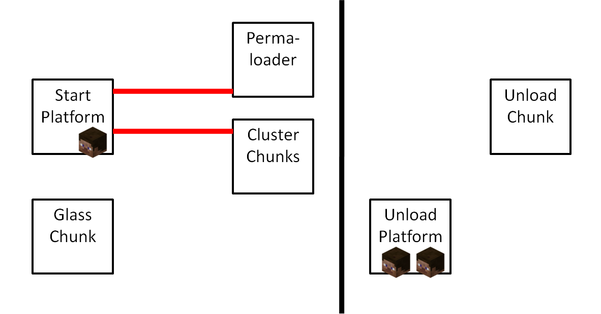

# Async Chunk Loading / Chunk Swaps ☆

## Table of Contents


- [Introduction](#introduction)
  * [Terminology](#terminology)
- [Common Techniques](#common-techniques)
  * [Slowing down Stained Glass Threads](#slowing-down-stained-glass-threads)
  * [Racing to the Unload Phase](#racing-to-the-unload-phase)
- [Specific Methods](#specific-methods)
  * [Upsize Rehash Chunk Swap](#upsize-rehash-chunk-swap)
  * [Classical Multiplayer Unload Chunk Swap](#classical-multiplayer-unload-chunk-swap)
  * [ElRich Radixan Singleplayer Unload Chunk Swap](#elrich-radixan-singleplayer-unload-chunk-swap)
  * [Void Synchronized Method for Regular Async Load](#void-synchronized-method-for-regular-async-load)
- [Miscellaneous](#miscellaneous)
  * [Preventing crashes during async chunk load](#preventing-crashes-during-async-chunk-load)
  * [Using Chunk Swaps for Falling Block Swaps](#using-chunk-swaps-for-falling-block-swaps)


# Introduction

When a [chunk](chunk.md) is loaded on an [async thread](../threads.md), this is called an *async chunk load*.

The only async threads on which chunks can possibly be loaded are the [stained glass threads](../threads.md#stained-glass-threads).
This page will focus solely on how one can load chunks using the `getBlockState` calls in the stained glass thread code.

Async chunk loading is important, because an async chunk load can trigger an [async terrain population](population.md#glass-threads-causing-async-updates), which then causes async block updates,
which can be used for [threadstone exploits](../async-line.md#applications).

The best method for async chunk loading in survival is the [Void synchronized method](#void-synchronized-method-for-regular-async-load).

## Terminology

Loading a chunk on a stained glass thread is quite difficult, because the `getBlockState` calls of the thread all happen below the stained glass block that started the thread,
so these calls all happen in a chunk that was already loaded when the stained glass block got placed or broken.

The chunk in which we start the stained glass threads will be called the *glass chunk*.

There are two ways one can asyncly load a chunk using the `getBlockState` calls of the stained glass threads:
1. Unload the glass chunk, while the async threads are running in it. This case is called a *regular async load*.
2. Load the glass chunk even though it is already loaded. This case is called a *chunk swap*.

To do a chunk swap one needs to exploit [race conditions in the chunk hashmap](chunk-hashmap.md#race-conditions).

There are two kinds of chunk swaps, depending on the race condition one uses to get the chunk swap:
1. If one uses a [`get`+`remove` race condition](chunk-hashmap.md#get-remove), the chunk swap is called an *Unload Chunk Swap*.
2. If one uses a [`get`+`rehash` race condition](chunk-hashmap.md#get-rehash), the chunk swap is called a *Rehash Chunk Swap*.

There are two kinds of rehash chunk swaps: 
1. If the `rehash` downsizes the chunk hashmap, it is called a *Downsize Rehash Chunk Swap*.
2. If the `rehash` upsizes the chunk hashmap, it is called an *Upsize Rehash Chunk Swap*.

# Common Techniques

Before we discuss specific methods for async chunk loading, we discuss various techniques that appear in multiple specific setups.

## Slowing down Stained Glass Threads
For almost all async chunk loading methods it is important to slow down the stained glass threads relative to the main thread as much as possible, so that the main thread has time either unload the glass chunk,
or perform an operation that allows a chunk swap in the glass chunk.

The following methods can be used for slowing down stained glass threads:
1. [Cluster chunks](chunk-hashmap.md#cluster-chunks) can slow down the `getBlockState` call in the stained glass thread code.
2. Beacon blocks below the stained glass can force the stained glass thread code to call the `((ServerWorld)world).submit` function, which slows down the thread.

Beacons are particularly noteworthy, because they lead to a `synchronized` block.

Every stained glass thread executes the following code:
```
public static void updateBeam(World world, BlockPos pos) {
		HttpUtil.DOWNLOAD_THREAD_FACTORY.submit(new Runnable() {
			@Override
			public void run() {
				WorldChunk c_6849228 = world.getChunk(pos);
				for (int i = pos.getY() - 1; i >= 0; --i) {
					final BlockPos c_3674802 = new BlockPos(pos.getX(), i, pos.getZ());
					if (!c_6849228.hasSkyAccess(c_3674802)) {
						break;
					}
					BlockState c_2441996 = world.getBlockState(c_3674802);
					if (c_2441996.getBlock() == Blocks.BEACON) {
						((ServerWorld)world).submit(new Runnable() {
							@Override
							public void run() {
								BlockEntity c_3622326 = world.getBlockEntity(c_3674802);
								if (c_3622326 instanceof BeaconBlockEntity) {
									((BeaconBlockEntity)c_3622326).update();
									world.addBlockEvent(c_3674802, Blocks.BEACON, 1, 0);
								}
							}
						});
					}
				}
			}
		});
	}
```
If it finds a beacon, it call the `((ServerWorld)world).submit` function, which
calls the following code in the `MinecraftServer` class
```
public <V> ListenableFuture<V> submit(Callable<V> event) {
		Validate.notNull(event);
		if (!this.isOnSameThread() && !this.hasStopped()) {
			ListenableFutureTask<V> listenableFutureTask = ListenableFutureTask.create(event);
			synchronized (this.pendingEvents) {
				this.pendingEvents.add(listenableFutureTask);
				return listenableFutureTask;
			}
		} else {
			try {
				return Futures.immediateFuture(event.call());
			} catch (Exception var6) {
				return Futures.immediateFailedCheckedFuture(var6);
			}
		}
	}
```
and this contains a `synchronized (this.pendingEvents)` block.

This means that if multiple stained glass threads find beacon blocks at the same time, and try to submit their beacon beam color change task at the same time, then one of the threads has to wait for the other to finish the `synchronized` block.

This leads to the following additional method for slowing down stained glass threads:

3. If one has beacons below the stained glass blocks, then starting additional stained glass threads will slow down already existing stained glass threads more than it slows down the main thread.

Note that starting multiple stained glass threads is only worth it if one uses beacons. If one does not use beacons, then starting many many stained glass threads will still slow down the stained glass threads,
because they take execution time away from each other. But without beacons, having many stained glass threads does not slow them down relative to the main thread, because the stained glass threads will take away just as much execution time from the main thread as they take away from each other,
so that the relative speed of main thread and stained glass threads remains the same.

The `synchronized` block that the beacons lead to have another use.

The `MinecraftServer` class has another `synchronized (this.pendingEvents)` block at the beginning of the `tickWorlds` method
```
	synchronized (this.pendingEvents) {
		while (!this.pendingEvents.isEmpty()) {
			Utils.run(this.pendingEvents.poll(), LOGGER);
		}
	}
```
This is the [player phase of the main thread](../tick-phases.md#player-inputs).

This leads to another way of slowing down stained glass threads:

4. If a stained glass thread finds a beacon, while the main thread is in the player phase, then the stained glass thread will wait until the main thread has finished the player phase.

## Racing to the Unload Phase
All methods except for the upsize rehash chunk swap, require the main thread to unload a chunk as quickly as possible.

So the main thread needs to start the stained glass threads, and then needs to get to the [unload phase](../tick-phases.md#unload-phase) as quickly as possible.

It is usually considered unnecessarily annoying to start the stained glass threads in the [mob spawning phase](tick-phases.md#mob-spawning), so one usually starts them in the [player phase](tick-phases.md#player-phase).

The main thread then needs to:
- Finish the player phase
- Get through the mob spawning phase
- Get to the unloading phase, and unload the desired chunk
before the async threads run out and die.

To minimize the amount of time the main thread needs to do the above three things one can take the following measures:
1. Don't send unnecessary packets in the player phase.

This is only necessary if one does not use any beacons below the stained glass. If one does use beacons, then the stained glass threads will wait at the beacons for the player phase to finish anyway.
But if one does not use beacons, one needs to make sure that one doesn't move the mouse around unnecessarily or walks and jumps around with the player unnecessarily, because all of those things make the player phase take longer.

2. Use mob switches.

The mob spawning phase is a lot shorter if it spawns no actual mobs. This can be ensured by building mob switches for hostile mobs, passive mobs, squids and bats.

3. Don't unload unnecessary chunks

If the method requires you to unload a specific chunk, then you should make sure that this chunk is the only chunk that unloads in this gametick.
Otherwise there might be other chunks unloading before the desired chunk unloads, and this takes up time on the main thread.

# Specific Methods

## Upsize Rehash Chunk Swap

An upsize rehash chunk swap setup without cluster chunks in the end dimension is shown in cool mann's video [How to Get All* Unobtainable Blocks as Items in Minecraft Survival [1.12] pt. 1](https://www.youtube.com/watch?v=VTbpUjK-A74).

A [cluster chunk finder](chunk-hashmap.md#cluster-finder-programs) intended for upsize rehash chunk swaps by Cheater Codes is [here](https://github.com/CheaterCodes/easy-cluster/tree/main).

A world download by cool mann for rehash chunk swaps with cluster chunks is [here](https://www.mediafire.com/file/2l7gfzedckdd398/hekate_setup_42.rar/file), but instructions for how to use that world download are nowhere.


As explained in [the chunk hashmap article on rehash chunk swaps](chunk-hashmap.md#get-rehash) upsize rehash chunk swaps only work in specific locations:
- If one uses no cluster chunks, then rehash chunk swaps work in chunks whose hash value is exactly 2^n after upsizing, where n is the number of bits of the chunk hashmap before upsizing.
- If one uses [cluster chunks](chunk-hashmap.md#cluster-chunks), then the rehash can be done in any chunk whose hash value is near the end of the chunk hashmap, but whose index has been forced to the beginning of the chunk hashmap by the cluster.

We will now assume that the glass chunk we want to asyncly load is in such a suitable location.

To do an upsize rehash chunk swap, the main thread needs to upsize the chunk hashmap, while stained glass threads are running in the glass chunk.
This means the main thread needs to do the following things:
1. Load chunks until the chunk hashmap is 3/4 filled, so that an additional chunk load can upsize the chunk hashmap.
2. Place or break stained glass in the glass chunks, to start the stained glass thread.
3. Load an additional chunk. This chunk is called the *rehash* chunk.
4. Upsize the chunk hashmap.

The main difficulty is to keep the async threads alive, while the main thread is loading the rehash chunk.
To keep the async threads alive one should of course use the usual methods for [slowing down stained glass threads](#slowing-down-stained-glass-threads).

But to make the chunk loading on the main thread as fast as possible one can use the following methods:

1. Use a rehash chunk with as few chunk sections as possible.

When a chunk is loaded, the game needs to iterate through all blocks in all the chunk sections that exist in the nbt data of the chunk.
This is the main bottleneck that makes upsize rehash chunk swaps difficult.

In the end dimension, there are true void chunks which generate with 0 chunk sections, which allows for easy upsize rehash chunk swaps.

In the overworld all chunks have at least 4 chunk sections.

In the nether all chunks generate with exactly 8 chunk sections.

It is not possible to decrease the amount of chunk sections a chunk has. Mining out a chunk section, just gives you a chunk section full of air, but does not remove the chunk section from the nbt data.
If a block is placed or light enters a chunk in a certain chunk section once, then this chunk has this chunk section, and all sections below it, forever.

For this reason, it is much easier to do upsize rehash chunk swaps in the end, than in the overworld or nether.

2. Load the rehash chunk from the cache of the Anvil chunk loader

When a chunk gets unloaded, the `chunk` instance gets put into the `chunkSaveQueue` in the `AnvilChunkStorage` class.
It then gets saved to disk by the [chunk saving thread](../threads.md#chunk-saving-thread).
If the chunk gets reloaded before it got saved to disk, then it will be returned from the `chunkSaveQueue` instead of being reloaded from disk.

Returning a chunk from the `chunkSaveQueue` is slightly faster than loading it from disk,
so when one does an upsize rehash chunk swap, it is recommended one loads the rehash chunk from the `chunkSaveQueue` rather than loading it from disk.

This does not prevent the game from iterating over every block in every chunk section of the rehash chunk, so one still needs to minimize chunk sections.
But it does help a little bit nonetheless.

## Classical Multiplayer Unload Chunk Swap
An unload chunk swap setup for multiplayer is shown in [Falling Block Episode 3](https://www.youtube.com/watch?v=8-AumLja16A).

World download is [here](https://www.mediafire.com/file/shf3k8uyikdupuv/Chunk+swap+world.zip/file).

Render Distance 16.

As explained in the [explanation of unload chunk swaps in the chunk hashmap article](chunk-hashmap.md#get-remove),
for an unload chunk swap, we need a *glass chunk* with which we want to do the chunk swap,
and we have an *unload chunk* that is clustering the glass chunk.

In the setup the unload chunk has the same hash value as the glass chunk.
The setup also includes 1000 cluster chunks whose hash values start right after that of the unload chunk.
So if one loads the unload chunk and the 1000 cluster chunks and then loads the glass chunk, then the glass chunk will get 1000 clustering,
and unloading the unload chunk will shift the index of the glass chunk down by 1000. This creates ideal conditions for an unload chunk swap.

In the above setup we additionally have a *start platform* which is right outside of view distance of the glass chunk,
and we have a *unload platform* which is diagonally offset from the unload chunk, and just barely still within view distance of the unload chunk.

The setup uses 3 players.

Player 1 stands at the start platform.
Player 2 and 3 stand at the unload platform. Player 2 is within view distance of the unload chunk. Player 3 is outside the view distance of the unload chunk.



To use the setup we execute several steps:
1. Player 1 activates some levers at the start platform which load the permaloader, the mob switches, and the 1000 cluster chunks. Then we wait for an autosave.

2. All players simultaneously relog. This is done to downsize the chunk hashmap. While loading the 1000 cluster chunks, the game also loads many unnecessary chunks, and upsizes the chunk hashmap to hashsize 16384.
After an autosave, if all players relog, the chunk hashmap downsizes back to 8192, which is the intended hashsize for the setup.

3. Player 2 aligns against a cobble wall at the unload platform and relogs. After this the unload chunk is loaded, and player 2 has a specific position in the player chunk map right next to the cobble wall.
The position of player 2 in the player chunk map will only update again once he goes more than 8 blocks away from his previous position. The cobble wall is exactly 8 blocks away from a chunk border.
So if player 2 later crosses that chunk border the unload chunk will immediately get scheduled to unload. So aligning against the cobble wall and relogging gives us a precise way to control when exactly the unload chunk gets scheduled to unload.

4. Player 1 activates a lever at the start platform which creates an [invisible chunk](population.md#invisible-chunk-1) next to the glass chunk, and turns on [instant tile ticks](population.md#instant-tile-ticks). Then Player 1 flies to the glass chunk before the next autosave occurs.

5. Player 2 activates an [observer chain that creates a lag spike](update-multiplier.md#lag-spikes) lasting for roughly ten seconds.
During this lag spike, player 2 walks across a chunk border away from the unload chunk.
Then player 1 at the glass chunk places 36 stained glass blocks above a beacon tower consisting of 4500 beacons.

After the lag spike all these player actions will be executed in a single gametick in the player phase.

When player 2 walks across the chunk border, this scheduled the unload chunk to unload.

All other chunks that player 2 might have scheduled to unload stay within view distance of player 3, so the presence of player 3 ensures that no unnecessary chunks get scheduled to unload.

Player 1 then places all the stained glass blocks and starts 36 stained glass threads.

The stained glass threads get slowed down both by the 4500 beacons and the 1000 cluster chunks.

Meanwhile the main thread finishes the player phase, then goes through a mob spawning phase, that is short due to mob switches,
and then enters the chunk unloading phase, in which only a single chunk gets unloaded, namely the unload chunk.

The stained glass threads are then usually still alive when the unload chunk gets unloaded, and an unload chunk swap can happen.
In fact in the setup usually multiple stained glass threads manage to perform an unload chunk swap, and the already loaded glass chunk gets reloaded by multiple async thread.
However usually only one of the async threads manages to populate the invisible chunk, and create async block updates.

## ElRich Radixan Singleplayer Unload Chunk Swap
A video showing this setup is ElRich's [Survival 1.12 Ep155, Cómo conseguir BEDROCK en modo supervivencia, at 1:00:12](https://www.youtube.com/watch?v=VkrYzPefX3I&t=3612s).

World download is [here](https://www.mediafire.com/file/e24srbvb6melto7).

This setup is very similar to the [classical multiplayer unload chunk swap](#classical-multiplayer-unload-chunk-swap),
except that it only requires a single player, instead of 3.
The unload chunk is loaded using redstone. The unloading of the unload chunk is scheduled by pressing ESC, instead of having a player go away from it.

The following text passage explaining this ESC mechanic is by ElRich:

In SSP, at the start of the tick you can pause the game by opening the pause menu (ESC), using a book, placing a sign...

When the game is paused, it will save the world just like an autosave would (the only difference is that this way prints "Saving the world" messages).

We can use this to unload the unload chunk on demand in a precise tick. In order to do that, once the glass chunk is loaded, we send a signal to stop keeping it loaded. However, we are loading the chunks that the wire goes through by doing so. Instead we use a timer to keep it loaded some time so we can unload them first.

To synchronize the placing of glass with the unload, we lag the game two consecutive ticks.

During the first lag spike we have to trigger a world save by pressing ESC.

(We can detect when the spike has ended typing in the chat previously since it will be prompted later in the same tick, or by looking at the console.)
Once the lag ends, we resume the game and, at the start of the next tick, the game unloads 100 chunks that are part of the permaloader.
Then, during the second lag spike, we place stained glass.

The next tick, the rest of chunks that are not permaloaded are unloaded. Preferably we want the unload chunk to be the only one.


## Void Synchronized Method for Regular Async Load
This is a Regular Async Load method, based on a clever exploitation of `synchronized` blocks discovered by Void.

World Download is [here](https://www.mediafire.com/file/b3selx32rzkd4ss/Voids_synchronized.zip/file).

Instructions:

Render distance 10.

The platform for operating the setup is at 10229 129 -5400.

Align against the cobble wall and relog.

Wait for an autosave, then flick the levers/buttons with the signs 1 to 5 in the correct order.

If you get no async line, fly two or three chunks away from the setup, wait two or three seconds, fly in, and do another attempt.

Explanation:

The main difficulty with performing an async regular load is that the `getBlockState` calls of the async thread can cancel chunk unloading.
So to perform an async regular load, one needs to first schedule the chunk in which the async thread is running to be unloaded, and this scheduling happens in the player phase or even earlier. And then the main thread needs to get through the whole player phase, and the whole mob spawning phase and into the unload phase, all while the async thread does not do a single `getBlockState` call.
If the async thread does do a single `getBlockState` call in this time, then the scheduled chunk unloading will be cancelled, and the chunk will not get unloaded in the unload phase.

Void's synchronized setup use ITT instantfalling dragon eggs to break over 1000 stained glass blocks and start over 1000 stained glass threads.
This is all done in the [player phase](tick-phases.md#player-phase), and all the stained glass blocks have beacons underneath them.
As explained in the section on [slowing down stained glass threads](#slowing-down-stained-glass-threads), all the stained glass threads will wait at the beacons, until the main thread has finished the player phase.
So at the end of the player phase, all the 1000 stained glass threads will still be alive, even though the player phase with all its instantfalling dragon eggs took a really long time.

All except one of the stained glass threads are started in an irrelevant chunk we do not care about.
Only one of the stained glass threads gets started in the glass chunk that we want to asyncly reload.

After the player phase, the 999 stained glass threads in the irrelevant chunk manage to stop the one thread in the glass chunk in front of the `synchronized` block in the `submit` code for such a long time, that the main thread can unload the glass chunk.
Once the one thread in the glass chunk finally gets past the `synchronized` block, it does a `getBlockState` call and regularly reloads the glass chunk.

# Miscellaneous

## Preventing crashes during async chunk load

When a chunk is loaded on an async thread, then the async thread will load in all the entities and tile entities that exist in that chunk.
If the main thread starts processing entities or tile entities while the async thread is loading in entities or tile entities, then this can crash the game in a `ConcurrentModificationException`.

For this reason it is customary to create a lag spike on the main thread in the [block event phase](../tick-phases.md#block-event-phase) right after one has performed an async chunk load, to prevent the main thread from processing entities or tile entities too early.
One can create a lag spike during the block event phase, by activating a piston, and letting the piston activate an [update multiplier chain](../update-multiplier.md#lag-spikes).

## Using Chunk Swaps for Falling Block Swaps
Chunk Swaps can be used to replace gravity affected blocks by a different blocks on an async thread, and in this way they can be used for [falling block swaps without async lines](../falling-block/falling-block-swaps.md#old-coolmann-method).


