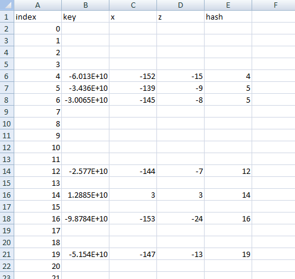
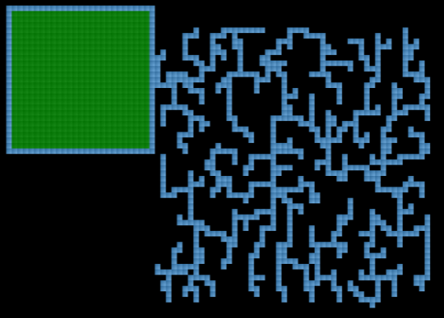
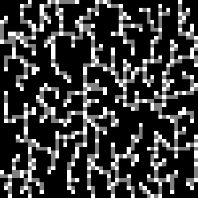

# Chunk Hashmap ☆

## Table of Contents

- [Introduction](#introduction)
  * [`put` - Loading Chunks](#put)
  * [`get` - Getting Chunks](#get)
  * [`remove` - Unloading Chunks](#remove)
  * [`rehash` - Resizing Chunk Hashmap](#rehash)
- [Race Conditions](#race-conditions)
  * [`get` + `remove` - Unload Chunk Swap](#get-remove)
  * [`get` + `rehash` - Rehash Chunk Swap](#get-rehash)
  * [`remove` + `rehash` - Wormhole Chunk](#remove-rehash)
- [Cluster Chunks](#cluster-chunks)
  * [Applications](#applications)
  * [Cluster Finder Programs](#cluster-finder-programs)
    + [Earthcomputer](#earthcomputer)
    + [Vastech](#vastech)
    + [Cheater Codes](#cheater-codes)

# Introduction

In each dimension the loaded chunks are stored in a [`Long2ObjectOpenHashmap`, from fast-utils version 7.1.0](../../resources/Long2ObjectOpenHashmap.java).

In carpet mod one can print out the chunk hashmap using the command `/loadedChunks dump`. The command creates an excel file in the server folder, which looks like this



Every entry in this excel file is a loaded chunk.

The length of the excel file is the *hashsize* of the chunk hashmap. The hashsize is always a power of 2, and can increase or decrease if many chunks are loaded or unloaded. See [resizing](#rehash).
If the hashsize is 2^n, we call n the *number of bits* of the chunk hashmap.

The chunk hashmap has a `key` array and a `values` array. The `values` array stores chunk instances, the `key` array stores keys of chunks which are explained below.
The length of the `key` and `value` arrays are one larger than the hashsize. The last spot in these arrays is always unused, storing the key `0L` and the chunk `null`.

Every loaded chunk has *x and z coordinates*, a *key*, a *hash value*, and an *index* that it occupies in the chunk hashmap.

- The x and z coordinates are chunk coordinates, which means they are 16 times the block coordinates of the chunk.
For example the chunk with the chunk coordinates -152 -15 has block coordinates x=-2432, z=-240.

- The key of a chunk depends solely on the x and z coordinates of the chunk, and is calculated by the formula
`(long)x & 4294967295L | ((long)z & 4294967295L) << 32`.

- The hash value of a chunk depends on the key of the chunk and the hashsize of the chunk hashmap.
Using the key one first calculates the `HashCommon.mix` function.
```
public static final long mix(long key) {
        long h = key * -7046029254386353131L;
        h ^= h >>> 32;
        return h ^ h >>> 16;
    }
```
The hash value of the chunk is then calculated by the formula `(int)HashCommon.mix(key) & this.mask`
where `this.mask` is one less than the hashsize of the chunk hashmap.
So in binary, `this.mask` is equal to `1111...111` where the number of `1`s is the number of bits of the chunk hashmap.
So `(int)HashCommon.mix(key) & this.mask` takes the last n bits from `(int)HashCommon.mix(key)`, where n is the number of bits of the chunk hashmap.

The hash value that a chunk has in the chunk hashmap has nothing to do with the hash value the chunk has in the [chunk unload order](chunk.md#unloading).

- The index of a chunk depends on when exactly the chunk is entered into the hashmap.

## `put` - Loading Chunks <a name="put"/>
When a chunk gets loaded, the game adds it to the chunk hashmap,
which happens using the following `put` function, 
where `v` is the chunk and `k` is the key of the chunk.

```
 public V put(long k, V v) {
        int pos = this.insert(k, v);
        if (pos < 0) {
            return this.defRetValue;
        } else {
            V oldValue = this.value[pos];
            this.value[pos] = v;
            return oldValue;
        }
    }
```
This function calls the following `insert` function.
```
 private int insert(long k, V v) {
        int pos;
        if (k == 0L) {
            if (this.containsNullKey) {
                return this.n;
            }
            this.containsNullKey = true;
            pos = this.n;
        } else {
            long[] key = this.key;
            long curr;
            if ((curr = key[pos = (int)HashCommon.mix(k) & this.mask]) != 0L) {
                if (curr == k) {
                    return pos;
                }
                while((curr = key[pos = pos + 1 & this.mask]) != 0L) {
                    if (curr == k) {
                        return pos;
                    }
                }
            }
        }
        this.key[pos] = k;
        this.value[pos] = v;
        if (this.size++ >= this.maxFill) {
            this.rehash(HashCommon.arraySize(this.size + 1, this.f));
        }
        return -1;
    }
```

The game will calculate the hash value of the chunk,
and then check whether the index equal to the hash value is unoccupied in the chunk hashmap.
If it is unoccupied, the chunk will be entered into that index.
Otherwise the chunk will try to enter the next index.
It will repeatedly increase the index by 1 until it finds an empty spot, and then enters that spot in the chunk hashmap.

For example in the picture in the introduction the chunk at position -145 -8 has hash value 5,
but it entered index 6, because when it was added index 5 was already occupied by the chunk at position -139 -9,
so the chunk at -145 -8 had to take the next index.

After every `insert` operation the chunk hashmap will check whether it should [upsize](#rehash).

## `get` - Getting Chunks <a name="get"/>
If the game wants to do anything with a chunk at a certain position, it first needs to get that chunk from the chunk hashmap.
This happens for example every time the game does a `getBlockState` call or `setBlockState` call in the chunk.

When the game tries to get a chunk from the chunk hashmap it calls the following `get` function, where `k` is the key of the chunk.
```
public V get(long k) {
        if (k == 0L) {
            return this.containsNullKey ? this.value[this.n] : this.defRetValue;
        } else {
            long[] key = this.key;
            long curr;
            int pos;
            if ((curr = key[pos = (int)HashCommon.mix(k) & this.mask]) == 0L) {
                return this.defRetValue;
            } else if (k == curr) {
                return this.value[pos];
            } else {
                while((curr = key[pos = pos + 1 & this.mask]) != 0L) {
                    if (k == curr) {
                        return this.value[pos];
                    }
                }
                return this.defRetValue;
            }
        }
    }
```
It calculates the hash value of the chunk, and then tries to see whether a chunk with the correct key is at the index corresponding to the hash value.
If it finds such a chunk it returns it. Otherwise it will look for the chunk at the next index.
It will continually increase the index where it looks for the chunk by 1, until it has either found a chunk with the correct key and returns it,
or it has found an empty spot in the chunk hashmap.
If it finds an empty spot, it will return `defRetValue`, and the game will assume that the chunk in question is not loaded.

This `get` method can be slowed down using [cluster chunks](#cluster-chunks).

## `remove` - Unloading Chunks <a name="remove"/>
When a chunk gets unloaded, the game calls the following `remove` function, where `k` is the key of the chunk.
```
  public V remove(long k) {
        if (k == 0L) {
            return this.containsNullKey ? this.removeNullEntry() : this.defRetValue;
        } else {
            long[] key = this.key;
            long curr;
            int pos;
            if ((curr = key[pos = (int)HashCommon.mix(k) & this.mask]) == 0L) {
                return this.defRetValue;
            } else if (k == curr) {
                return this.removeEntry(pos);
            } else {
                while((curr = key[pos = pos + 1 & this.mask]) != 0L) {
                    if (k == curr) {
                        return this.removeEntry(pos);
                    }
                }
                return this.defRetValue;
            }
        }
    }
```

The game first tries to find the chunk, similar to the `get` function.
Once it finds the chunk in the chunk hashmap, it calls the `removeEntry` function, where `pos` is the index of the chunk.

```
   private V removeEntry(int pos) {
        V oldValue = this.value[pos];
        this.value[pos] = null;
        --this.size;
        this.shiftKeys(pos);
        if (this.size < this.maxFill / 4 && this.n > 16) {
            this.rehash(this.n / 2);
        }

        return oldValue;
    }
```
In that function it calls the `shiftKeys` function, where `pos` is the index of the chunk.
```
  protected final void shiftKeys(int pos) {
        long[] key = this.key;
        while(true) {
            int last = pos;
            pos = pos + 1 & this.mask;
            long curr;
            while(true) {
                if ((curr = key[pos]) == 0L) {
                    key[last] = 0L;
                    this.value[last] = null;
                    return;
                }
                int slot = (int)HashCommon.mix(curr) & this.mask;
                if (last <= pos) {
                    if (last >= slot || slot > pos) {
                        break;
                    }
                } else if (last >= slot && slot > pos) {
                    break;
                }
                pos = pos + 1 & this.mask;
            }
            key[last] = curr;
            this.value[last] = this.value[pos];
        }
    }
```
The `shiftKeys` method removes the chunk from the chunk hashmap. It then checks whether moving any other chunk in the hashmap to the index of the removed chunk can reduce the difference between index and hash value of those chunks.
It repeatedly moves chunks from one index to the index of the previously moved chunk, until it is no longer possible to reduce the difference between index and hash value of a chunk without increasing that of another chunk.

After it has completed the `shiftKeys` function, the chunk hashmap will check whether it should [downsize](#rehash).

## `rehash` - Resizing Chunk Hashmap <a name="rehash"/>

The `rehash` function changes the hashsize of the chunk hashmap to a given number `newN`.
This `newN` is always a power of 2.

```
protected void rehash(int newN) {
        long[] key = this.key;
        V[] value = this.value;
        int mask = newN - 1;
        long[] newKey = new long[newN + 1];
        V[] newValue = (Object[])(new Object[newN + 1]);
        int i = this.n;

        int pos;
        for(int j = this.realSize(); j-- != 0; newValue[pos] = value[i]) {
            do {
                --i;
            } while(key[i] == 0L);

            if (newKey[pos = (int)HashCommon.mix(key[i]) & mask] != 0L) {
                while(newKey[pos = pos + 1 & mask] != 0L) {
                }
            }

            newKey[pos] = key[i];
        }

        newValue[newN] = value[this.n];
        this.n = newN;
        this.mask = mask;
        this.maxFill = HashCommon.maxFill(this.n, this.f);
        this.key = newKey;
        this.value = newValue;
}
```

The `rehash` function is called in one of two situations:
- Near the end of a `put` call the amount of chunks in the chunk hashmap is more than 3/4 of the current hashsize.
- Near the end of a `remove` call the amount of chunks in the chunk hashmap is less than 3/16 of the current hashsize.

In the first case, the chunk hashmap will *upsize*, and double its hashsize, by calling the `rehash` function with `newN` equal to double its current hashsize.

In the second case, the chunk hashmap will *downsize*, and halve its hashsize, by calling the `rehash` function with `newN` equal to half its current hashsize.

Here are some values of 3/4 * 2^n for various n.
These numbers are the amount of chunks at which upsizes or downsizes can occur:

96, 192, 384, 768, 1536, 3072, 6144, 12,288

So for example, if we have hashsize 256, and have 192 chunks loaded, then loading one additional chunk will upsize the chunk hashmap to hashsize 512.

And if we have hashsize 512 and have 96 chunks loaded, then unloading a chunk will downsize the chunk hashmap to hashsize 256.


# Race Conditions
The `Long2ObjectOpenhashmap` is a data structure that does not support asynchronous operations. If multiple threads access the `Long2ObjectOpenhashmap` at the same time, it can fail to work as intended.
In minecraft, the chunk hashmap can be accessed simultaneously by both the [main thread](../threads.md#main-thread) and the [stained glass threads](../threads.md#stained-glass-threads).
This makes many race conditions with the chunk hashmap possible in minecraft.

The race conditions occur when pairs of the functions `get`, `put`, `remove` and `rehash` are called on two different threads at the same time.

- The combinations `get`+`get` and `put`+`get` cause no race conditions. All other combinations do lead to some kind of race condition.

- The combination `remove`+`remove` is not possible to in minecraft, because the `remove` function can only be called on the main thread, and not on stained glass threads.
All other pairs of the above four functions are possible in minecraft.

- The combination `put`+`remove` makes it possible to place a chunk in an inaccessible part of the chunk hashmap. This is not very interesting, and has no visible effect on the game.

- The combinations `put`+`put`, `put`+`rehash`, `rehash`+`rehash` can cause chunks to end up at wrong positions. More precisely, these race conditions can make it so that there are indices in the chunk hashmap in which the key at the index does not come from the chunk at that index.
The `key` determines the position at which the chunk can be found in game, so the chunk at that index can then be found at a wrong position. Beyond changing chunk positions these race conditions cause no visible effects in game.

The other possible race conditions are more interesting and will now be described in detail.

## `get` + `remove` - Unload Chunk Swap <a name="get-remove"/>
If one thread calls the `remove` method while another thread calls the `get` method, then it can happen that the `get` method fails to find a chunk, even when the chunk is in the chunk hashmap.
This results in an [unload chunk swap](async-chunk-loading.md#unload-chunk-swap).

## `get` + `rehash` - Rehash Chunk Swap <a name="get-rehash"/>
If one thread calls the `rehash` method while another thread calls the `get` method, then it can happen that the `get` method fails to find a chunk, even when the chunk is in the chunk hashmap.
This results in a [rehash chunk swap](async-chunk-loading.md#rehash-chunk-swap).


In the `rehash` code we have the line
```
        this.mask = mask;
```
that replaces the old `mask` by the new mask.

In the `get` method we have these lines

```
 long[] key = this.key;
 long curr;
 int pos;
 if ((curr = key[pos = (int)HashCommon.mix(k) & this.mask]) == 0L) {
      return this.defRetValue;
 } else if (k == curr) {
      return this.value[pos];
 } else {
      while((curr = key[pos = pos + 1 & this.mask]) != 0L) {
           if (k == curr) {
                 return this.value[pos];
           }
      }
  return this.defRetValue;
  }
```
If `this.mask` changes after the `get` method has executed the `long[] key = this.key` line, but before the `get` method has found its chunk,
then the `get` method can access elements of the `key` array that it would usually not access,
because the lines `(int)HashCommon.mix(k) & this.mask` or `pos + 1 & this.mask` can give unexpected values. 
If the `key` array has the empty key `0L` at one of these unexpected values, the `get` method will not find its chunk, and a rehash chunk swap happens.

Rehash chunk swaps can happen both when upsizing and downsizing the chunk hashmap.
But not every chunk can be used for a rehash chunk swap. There are certain restrictions on the hash value the chunk needs to have.
The case of upsizing will now be discussed in more detail.

Suppose the rehash is upsizing the chunk hashmap from n bits to n+1 bits.

For the new value of `(int)HashCommon.mix(k) & this.mask` there are 3 possible outcomes:
- The (n+1)-th bit of `(int)HashCommon.mix(k)` is 0: In this case `(int)HashCommon.mix(k) & this.mask` does not change at all, and no rehash chunk swaps happens.
- The (n+1)-th bit of `(int)HashCommon.mix(k)` is 1, and some of the first n bits of `(int)HashCommon.mix(k)` are also 1: In this case `(int)HashCommon.mix(k) & this.mask` will be larger than 2^n, and then the line `key[pos = (int)HashCommon.mix(k) & this.mask]` throws an `ArrayIndexOutOfBounds` exception, which terminates the thread that does the `get` call.
- The (n+1)-th bit of `(int)HashCommon.mix(k)` is 1, and all of its earlier bits are 0: In this case `(int)HashCommon.mix(k) & this.mask` will be exactly 2^n. The line `key[pos = (int)HashCommon.mix(k) & this.mask]` accesses the always unused key `0L`, so a rehash chunk swap occurs.

So the `(int)HashCommon.mix(k) & this.mask` line can only be used for rehash chunk swaps in chunks whose hash value after the upsize is exactly `100...000`, where the number of `0`s is equal to the number of bits of the chunk hashmap before the upsize.

Let us next look at how `pos + 1 & this.mask` can be changed.

The `get` method only reaches the `pos + 1 & this.mask` line, if we have [cluster chunks](#cluster-chunks) slowing down the `get` access.

Also, changing the mask will only change the value of `pos + 1 & this.mask` if we have just reached the very end of the chunk hashmap while iterating through the cluster chunks.
In that case we will again get the unused `0L` key that is always at the end of the `key` array, and get a successful rehash chunk swap.

So to get a rehash chunk swap with the `pos + 1 & this.mask` line, the `get` method needs to start iterating through cluster chunks, then the `rehash` method needs to change the mask, and then the `get` method needs to reach the very end of the chunk hashmap before it finds its chunk.
This is only possible if the chunk the `get` method is looking for had a hash value near the end of the chunk hashmap, and the cluster chunks forced the chunk to take an index near the beginning of the chunk hashmap.

So for example if one has a hashsize of 8192, and has 1000 cluster chunks occupying all of the last 1000 indices of the chunk hashmap, and then loads a chunk with hash value 7200, then this chunk will be placed at the beginning of the chunk hashmap,
and one can do a rehash chunk swap in that chunk. If one uses only 500 cluster chunks, then it is impossible to do a rehash chunk swap with a chunk with hash value 7200.

Also note, that the more cluster chunks there are, the more likely it is that `this.mask` is changed at some point in time while the `get` method iterates through the cluster chunks.

So with rehash chunk swaps, cluster chunks improve both the chances of the rehash chunk swap occuring, and they increase the number of positions at which it is possible for a rehash chunk swap to occur.

**Conclusion**:
- Without cluster chunks, rehash chunk swaps can only be done with chunks whose hash value after the upsize is exactly 2^n, where n is the number of bits before the upsize. So only very few specific chunks can be used.
- With cluster chunks, one can use any chunk with a hash value near the end of the chunk hashmap, that has been moved by the cluster chunks to the beginning of the chunk hashmap.
- Attempting to do a rehash chunk swap in a chunk whose hash value is not exactly 2^n after the upsize can result in an `ArrayIndexOutOfBounds` exception, even if one uses cluster chunks. This can [kill async lines](../async-line.md#async-thread-crashing) whenever one upsizes the chunk hashmap.


## `remove` + `rehash` - Wormhole Chunk <a name="remove-rehash"/> 

If the async thread upsizes the chunk hashmap while the main thread unloads a chunk, then it can happen that a single chunk instance has two keys in the chunk hashmap, so that this single chunk instance appears at two different positions in the game.
This creates a *wormhole* chunk. In the game this chunk is at two different positions at once, corresponding to the two different keys at the two different indices of the chunk.
Placing or breaking a block at one of the positions of the chunk also places or breaks the block at the other position of that chunk.


# Cluster Chunks
An explanation of cluster chunks is in [Falling Block Episode 5, at 3:45](https://www.youtube.com/watch?v=DhohUJiJ1E8&t=225s).

*Cluster chunks* are a set of chunks that occupy subsequent entries in the chunk hashmap without any holes.

In the `/loadedChunks dump` excel sheet cluster chunks look like this:


If cluster chunks are loaded, and one loads an additional chunk which has a hash value that would usually place it somewhere in the beginning of the cluster,
then the cluster chunks will force that chunk to be placed somewhere at the end of the cluster. This then results in a loaded chunk whose hash value is very different from its index in the chunk hashmap.

We say that a chunk is *clustered* if its hash value is very different from its index in the chunk hashmap.
The difference between the index and the hash value is called the *amount of clustering* the chunk has.

For example in the above picture the chunk at position 90 90 has a hash value of 613, but an index of 1834.
This means that the chunk at position 90 90 has 1221 clustering, which is a lot.

When a chunk has a lot of clustering, then this slows down all `get` and `containsKey` calls that try to get that chunk from the hashmap, because whenever a `get` call for that chunk is made, the game will first try to find the chunk at the index corresponding to the hash value of the chunk,
and then iterate one by one through all the cluster chunks before it finds the desired chunk.

For example, if we have the chunk hashmap from the above picture, and the game does a `getBlockState` call in the chunk with chunk coordinates 90 90, then it has to iterate through 1221 cluster chunks before it finds that chunk. This slows down the `getBlockState` call by a lot.

This slowdown makes cluster chunks a quite subtle but incredibly versatile method for influencing race conditions.

## Applications
Cluster Chunks are used for:
- Increasing the lifetime of stained glass threads in various [async chunk load setups](async-chunk-loading.md).
- Increasing the success chances of [rehash chunk swaps](async-chunk-loading.md#rehash-chunk-swap), and increasing the number of positions in which rehash chunk swaps can be done without crashing the asnyc thread.
- Increasing the success chances of [unload chunk swaps](async-chunk-loading.md#unload-chunk-swap).
- Increasing the success chances of [falling block swaps](../falling-block/falling-block-swaps.md#optimizing-chances-with-cluster-chunks).
- Increasing the success chances of player head creation.

## Cluster Finder Programs

The positions of cluster chunks are usually calculated using third party programs.

### Earthcomputer
Earthcomputer's Cluster Chunk Finder can be downloaded [here](https://github.com/Earthcomputer/FallingClusterFinderJava/releases).

A superficial tutorial for this cluster finder is in [Falling Block Episode 3, at 12:37](https://www.youtube.com/watch?v=8-AumLja16A&t=757s).

The cluster finder is primarily intended for [unload chunk swaps](async-chunk-loading.md#unload-chunk-swap), but can also be used for other purposes.

The cluster finder takes the chunk coordinates of a *glass chunk* as input.
It then calculates an *unload chunk* which has the same hash value as the glass chunk, and it calculates a claster whose hash values start directly after the hash value of the glass and unload chunk.

If one loads the unload chunk and the cluster chunks, then the glass chunk will be clustered.
Unloading the unload chunk will shift the glass chunk from the end of the cluster to the beginning of the cluster, and this can be used for an unload chunk swap.

### Vastech
The [vastech edition of carpet mod](https://github.com/Void-Skeleton/Carpet-Vastech-Addition).
contains a cluster finder for improving [falling block swap success rates](../falling-block/falling-block-swaps.md#optimizing-chances-with-cluster-chunks).

To use it you need to set a few values first:

`/cluster set targetStart <x> <z>`

`/cluster set targetEnd <x> <z>`

This would be the two corners in which you want to search for the optimal chunk to be clustered.

Then `/cluster set hashSize <n>`, `/cluster set clusterSize <n>`
to set the hash size and the number of cluster chunks.

Then `/cluster set clusterWidth <w>` to set the width of the cluster grid
and `/cluster set clusterSearchStart <x> <z>` to set the northwest corner of the cluster grid.

Now you run `/cluster compute optimalClustering` so that it will compute the optimal target chunk.

Then `/cluster compute clusterChunks`, this will compute for you the cluster chunks for a few optimal and suboptimal hash starts, and tell you how large the cluster should be
you should choose the cluster with the smallest size, and record its hash start
then run `/cluster set desiredHashStart <hash start>` to set this hash start
then everything is ready.

`/cluster construct loadCluster` will load all the cluster chunks.

`/cluster construct makeClusterLoader` will make you a basic loader with chest and hoppers that will load the cluster.

The cluster finder assumes that you pre-load the 2x2 area of chunks that are within 8 blocks of the sand block with which you do the falling block swaps.
The cluster finder does not ensure that such a pre-loaded 2x2 remains unclustered when downsizing the chunk hashmap from a larger hashsize. Sometimes one has to manually remove a few of the calculated cluster chunks to ensure this.

### Cheater Codes
A cluster chunk finder by Cheater Codes intended for [rehash chunk swaps](async-chunk-loading.md#rehash-chunk-swap) can be found [here](https://github.com/CheaterCodes/easy-cluster/tree/main).

The cluster finder calculates a [rectilinear minimum spanning tree](https://en.wikipedia.org/wiki/Rectilinear_minimum_spanning_tree) containing the cluster chunks, in order to minimize the number of non-cluster chunks that are loaded whenever one loads the cluster chunks. This is necessary to prevent the chunk hashmap from upsizing too early.

The following picture shows how such a cluster looks on a carpet chunk debug screen:



The following images shows which of those chunks are cluster chunks and which ones are not.
The white chunks are cluster chunks. The grey chunks are non-cluster chunks that need to be loaded to load the cluster:




