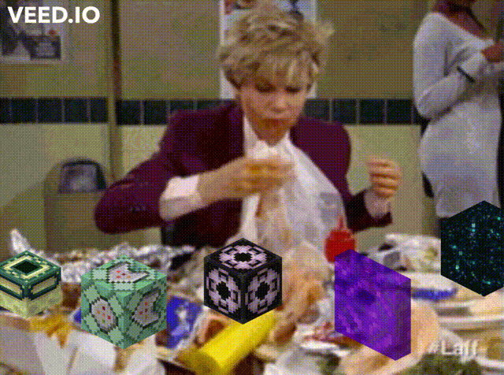
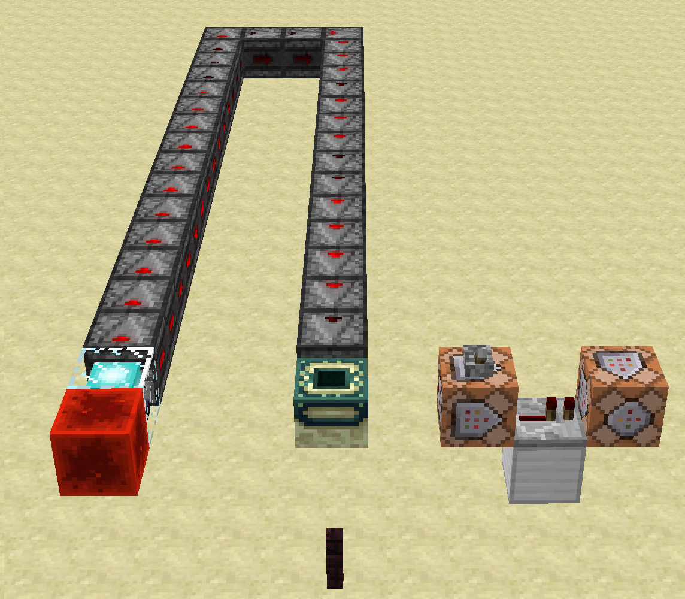

This page is about falling block swaps

# Introduction
A video explanation of falling block swaps is in [Falling Block Episode 2](https://www.youtube.com/watch?v=rNcFv5tccrg).
That video first covers pre-requisites for understanding falling block swaps, and starts explaining falling block swaps themselves at [13:50](https://www.youtube.com/watch?v=rNcFv5tccrg&t=830s).

When a [gravity-affected blocks](gravity-affected-block.md), that is not a dragon egg, does [normal falling behavior](gravity-affected-blocks.md#normal-falling-behavior) on one [thread](../threads.md),
while simultaneously another thread replaces the gravity-affected block by a different block,
then a race condition can occur that makes the first thread create a [falling block entity](falling-block-entity.md) of the block that the second thread places.
This is called a *falling block swap*.

Falling block swaps make it possible to create [falling block entities](falling-block-entity.md) of blocks which are not [gravity-affected blocks](gravity-affected-block.md).
If such a falling block entity is dropped on a stone slab, it will often drop an item of its block, even when that block would not drop an item under other circumstances.
For example a falling end portal frame will drop an end portal frame item, even though end portal frame blocks usually do not drop any item. Because of this falling block swaps are the most important method for obtaining unobtainable items.

The following meme shows 5 interesting falling blocks that can be created with falling block swaps, the first 3 of which drop interesting unobtainable items. A complete list of interesting falling block is [here](falling-block-entity.md#interesting-falling-blocks).



Most falling block swap methods use [instant tile ticks](../global-flags.md#instant-tile-ticks) and use observer chains as [update multipliers](../update-multipliers.md),
to send a lot of block updates at a high frequency into a gravity affected block, and thereby create falling block entities at a high frequency.
If one thread uses an observer chain to rapidly create falling block entities, while another thread replaces the gravity affected block by another block at a random point in time,
then there is a usually a 5-10% chance that a falling block swap randomly occurs.
The precise chance is hardware dependent. The chance can be improved using [cluster chunks](../chunk/cluster-chunks.md), and this is explained in [Falling Block Episode 5](https://www.youtube.com/watch?v=DhohUJiJ1E8).

To replace the gravity-affected block by another block, there is a very large variety of methods, most of which are complicated.

There are [specific methods](#specific-methods) for falling block swaps, which can only create one particular type of falling block,
and there are [generic methods](#generic-methods) for falling block swaps, which can create a wide variety of different falling blocks.

The most useful methods for survival are the [generic method using hashmap word tearing](#hashmap-word-tearing),
and the [specific method for nether portals using async portal lighting](#nether-portal-1).

## Falling Block Swaps with `setBlock` commands

For testing purposes and for understanding falling block swaps it can be helpful to first look at a non-survival-friendly falling block swap contraption that uses `/setblock` commands.



The left command block contains a `/setblock` command that replaces the end portal frame block by sand.

The right command block contains a `/setblock` command that replaces that sand block by an end portal frame again.

On the left side of the picture we have a powered beacon and an observer line with which we can create an [async line using carpet commands](../async-line.md#async-lines-using-carpet-commands).

To use the contraption, first create an async observer line by using `/carpet asyncBeaconUpdates true`, `/carpet instantScheduling true` and powering the beacon.
Then repeatedly flick the lever on the left command block.
Whenever the lever is flicked on, there will be a 5-10% chance that a falling block swap occurs that creates a falling end portal frame, because of the following reason:

Whenever the left command block replaces the end portal frame by sand, then we will have an async observer line updating the (gravity affected) sand block at a high frequency,
so the async thread will create falling sand entities at a very high frequency. Then the main thread activates the repeater and the second command block, and replaces the sand block by an end portal frame block again.
Since the main thread replaces the sand block by an end portal frame block, while the async thread quicly creates falling sand entities at the position,
a falling block swap can occur that results in a falling end portal frame.

The falling end portal frame will land on the nether brick fence and survive as a falling block entity. If the nether brick fence is replaced by a stone slab, the falling end portal frame will drop an end portal frame item.


# Code
When a sand block receives a block update, it will call the `scheduleTick` method:
```
public void scheduleTick(BlockPos pos, Block block, int delay, int priority) {
		Material material = block.defaultState().getMaterial();
		if (this.doTicksImmediately && material != Material.AIR) {
			if (block.acceptsImmediateTicks()) {
				if (this.isAreaLoaded(pos.add(-8, -8, -8), pos.add(8, 8, 8))) {
					BlockState blockState = this.getBlockState(pos);
					if (blockState.getMaterial() != Material.AIR && blockState.getBlock() == block) {
						blockState.getBlock().tick(this, pos, blockState, this.random);
					}
				}

				return;
			}

			delay = 1;
		}

		[...]
	}
```
The flag `doTicksImmediately` is the instant tile tick flag.
If instant tile ticks are on, then this method will check whether the blockstate of the position is still sand.
If the block is not sand, it will terminate the method.
If the block at the position is still sand, it will call the `tick` method of the `FallingBlock` class.
```
public void tick(World world, BlockPos pos, BlockState state, Random random) {
		if (!world.isClient) {
			this.tryFall(world, pos);
		}
	}
```
This then immediately calls the `tryFall` method of the `FallingBlock` class.
```
private void tryFall(World world, BlockPos pos) {
		if (canFallThrough(world.getBlockState(pos.down())) && pos.getY() >= 0) {
			int i = 32;
			if (fallImmediately || !world.isAreaLoaded(pos.add(-32, -32, -32), pos.add(32, 32, 32))) {
				[...]
			} else if (!world.isClient) {
				FallingBlockEntity fallingBlockEntity = new FallingBlockEntity(world, (double)pos.getX() + 0.5, (double)pos.getY(), (double)pos.getZ() + 0.5, world.getBlockState(pos));
				this.beforeStartFalling(fallingBlockEntity);
				world.addEntity(fallingBlockEntity);
			}
		}
	}
```
At the end of this method, it does a `getBlockState` call at its own position, and then creates a falling block entity of the blockstate it found.

A falling block swap occurs if the sand block is replaced by another block, after the sand check in the `scheduleTick` method has already happened,
but before the `getBlockState` call in the falling block entity creation line of the `tryFall` method has been executed.

## Optimizing Chances with Cluster Chunks

The `world.isAreaLoaded(pos.add(-32, -32, -32), pos.add(32, 32, 32)))` call in the `tryFall` method can be slowed down using [cluster chunks](../chunk/cluster-chunks.md) by slowing down chunk accesses to chunks that are less than 32 blocks away from the sand.
Slowing down that call increases the amount of time that passes between the sand check in the `scheduleTick` method and the crucial `getBlockState` call in the `tryFall` method.
This then increases the chances that the falling block swap race condition succeeds.

However one needs to be careful that one does not also slow down the `this.isAreaLoaded(pos.add(-8, -8, -8), pos.add(8, 8, 8))` check in the `scheduleTick` method,
the `getBlockState` call before the sand check in the `scheduleTick` method, and the speed of the observer line updating the sand, because slowing down those things
reduces the chance that the falling block swap race condition succeeds.

For this reason chunks that are within 8 blocks of the sand block should not be clustered.
To reach optimal falling block swap chances those chunks which are more than 8 but less than 32 blocks away from the sand should be clustered as much as possible.

# Specific Methods
We distinguish the specific methods by whether the interesting block is placed on the main thread while the async thread creates sand entities,
or whether the interesting block is placed on the async thread while the main thread creates sand entities.

## setBlockState() on main thread

### Nether Portal
A video explanation for this method is in [Falling Block Episode 2 at 18:50](https://www.youtube.com/watch?v=rNcFv5tccrg&t=1130s).

### End Portal Frame
A video explanation for this method is in [Falling Block Episode 2 at 36:36](https://www.youtube.com/watch?v=rNcFv5tccrg&t=2196s).

### Spawner
This method was performed on KiwiTech, as shown in rpm's video [Getting Falling Blocks on KiwiTech, at 8:30](https://www.youtube.com/watch?v=wiCrgOcSKSE&t=510s).

### Barrier
This method was performed on KiwiTech, as shown in rpm's video [Getting Falling Blocks on KiwiTech, at 13:15](https://www.youtube.com/watch?v=wiCrgOcSKSE&t=795s).

As explained in [Terrain Population - Igloo Barrier Block](../chunk/population.md#igloo-barrier-block), when an igloo has to replace a block with a tile entity by a furnace, it will first replace that block by a barrier block before placing the furnace.
If this barrier block replaces a gravity-affected block like sand, one can use this for a falling block swap.

There is one difficulty with this idea: No gravity-affected block has tile entity data, and the igloo population would replace a block without tile entity data directly by the furnace instead of placing the barrier.
To overcome this difficult one needs to use a [tile entity swap](../update-suppression.md#tile-entity-swap).

With the tile entity swap one can create air with tile entity data at the position where the furnace will be generated. One can then start the igloo population and let a sand block instantfall into the position of where the furnace will be generated.
Since the air at that position had tile entity data, we then get a sand block with tile entity data. The igloo population will then replace that sand block by a barrier block, and this can be used to perform a falling block swap for the barrier.

## setBlockState() on async thread

### Nether Portal
A video explanation for this method is in [Falling Block Episode 2 at 27:22](https://www.youtube.com/watch?v=rNcFv5tccrg&t=1642s).

### End Portal Frame
A video explanation for this method is in [Falling Block Episode 2 at 50:45](https://www.youtube.com/watch?v=rNcFv5tccrg&t=3045s).
This one is very difficult, because strongholds are a structure, and structure population is synchronized.

### Spawner
A video showing a falling block swap for spawners using carpet commands is in Myren's unlisted video [Async Population Spawner](https://www.youtube.com/watch?v=CVAoZLED3V4&list=PL8r-bvM9ltXNkjl7IhGQAHygIPfy2niuC&index=44).
Since dungeons are not a structure, dungeon population is not synchronized. This makes this method much easier to pull off without crashing the game than the async stronghold population method for end portal frames.

# Generic Methods

## Hashmap Word Tearing
A video explanation for this method is in [Falling Block Episode 6](https://www.youtube.com/watch?v=N1TuhgjUkc4).

## JKM's True Generic Method
JKM shows in the unlisted video [Yay large fern](https://www.youtube.com/watch?v=4fT3S6vRxSM) a fully general falling block swap method that can be used on every block of the game.
This makes it possible to obtain large fern items, which is the only block item that exists in 1.12 that cannot be obtained using the hashmap word tearing based generic method.

In 1.14+ versions large fern items generate naturally in village chests.

