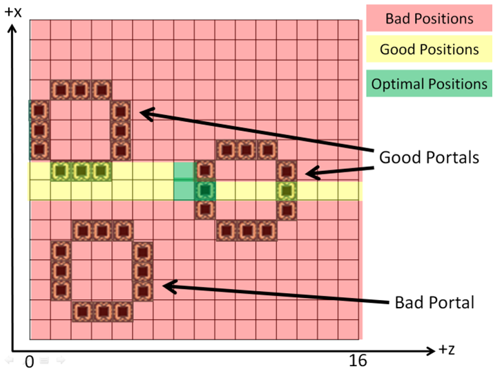
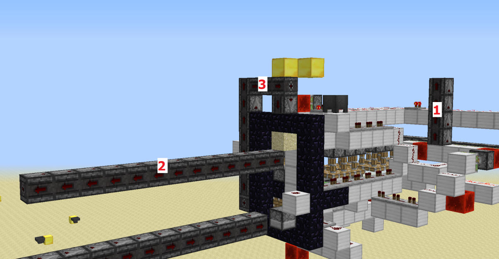

# Falling Block Swaps ☆

## Table of Contents

- [Introduction](#introduction)
  * [Falling Block Swaps with `setBlock` commands](#with-setblock-commands)
- [Code](#code)
  * [Optimizing Chances with Cluster Chunks](#optimizing-chances-with-cluster-chunks)
- [Specific Methods](#specific-methods)
  * [`setBlockState` on main thread](#set-on-main)
    + [Nether Portal](#nether-portal)
    + [End Portal Frame](#end-portal-frame)
    + [Spawner](#spawner)
    + [Barrier](#barrier)
  * [`setBlockState` on async thread](#set-on-async)
    + [Nether Portal](#nether-portal-1)
      - [Adjusting Observer Lines](#adjusting-observer-lines)
    + [End Portal Frame](#end-portal-frame-1)
    + [Spawner](#spawner-1)
- [Generic Methods](#generic-methods)
  * [Hashmap Word Tearing](#hashmap-word-tearing)
  * [JKM True Generic Method](#jkm-true-generic-method)
  * [Old Coolmann Method](#old-coolmann-method)


# Introduction
A video explanation of falling block swaps is in [Falling Block Episode 2](https://www.youtube.com/watch?v=rNcFv5tccrg).
That video first covers pre-requisites for understanding falling block swaps, and starts explaining falling block swaps themselves at [13:50](https://www.youtube.com/watch?v=rNcFv5tccrg&t=830s).

When a [gravity-affected blocks](gravity-affected-block.md), that is not a dragon egg, does [normal falling behavior](gravity-affected-blocks.md#normal-falling-behavior) on one [thread](../threads.md),
while simultaneously another thread replaces the gravity-affected block by a different block,
then a race condition can occur that makes the first thread create a [falling block entity](falling-block-entity.md) of the block that the second thread places.
This is called a *falling block swap*.

Falling block swaps make it possible to create [falling block entities](falling-block-entity.md) of blocks which are not [gravity-affected blocks](gravity-affected-block.md).
If such a falling block entity is dropped on a stone slab, it will often drop an item of its block, even when that block would not drop an item under other circumstances.
For example a falling end portal frame will drop an end portal frame item, even though end portal frame blocks usually do not drop any item. Because of this falling block swaps are the most important method for obtaining unobtainable items.

The following meme shows 5 interesting falling blocks that can be created with falling block swaps, the first 3 of which drop interesting unobtainable items. A complete list of interesting falling block is [here](falling-block-entity.md#interesting-falling-blocks).


Most falling block swap methods use [instant tile ticks](../global-flags.md#instant-tile-ticks) and use observer chains as [update multipliers](../update-multipliers.md),
to send a lot of block updates at a high frequency into a gravity affected block, and thereby create falling block entities at a high frequency.
If one thread uses an observer chain to rapidly create falling block entities, while another thread replaces the gravity affected block by another block at a random point in time,
then there is a usually a 5-10% chance that a falling block swap randomly occurs.
The precise chance is hardware dependent. The chance can be improved using [cluster chunks](../chunk/cluster-chunks.md), and this is explained in [Falling Block Episode 5](https://www.youtube.com/watch?v=DhohUJiJ1E8).

To replace the gravity-affected block by another block, there is a very large variety of methods, most of which are complicated.

There are [specific methods](#specific-methods) for falling block swaps, which can only create one particular type of falling block,
and there are [generic methods](#generic-methods) for falling block swaps, which can create a wide variety of different falling blocks.

The most useful methods for survival are the [generic method using hashmap word tearing](generic-method.md),
and the [specific method for nether portals using async portal lighting](#nether-portal-1).

## Falling Block Swaps with `setBlock` commands <a name="with-setblock-commands"/>

For testing purposes and for understanding falling block swaps it can be helpful to first look at a non-survival-friendly falling block swap contraption that uses `/setblock` commands.


The left command block contains a `/setblock` command that replaces the end portal frame block by sand.

The right command block contains a `/setblock` command that replaces that sand block by an end portal frame again.

On the left side of the picture we have a powered beacon and an observer line with which we can create an [async line using carpet commands](../async-line.md#async-lines-using-carpet-commands).

To use the contraption, first create an async observer line by using `/carpet asyncBeaconUpdates true`, `/carpet instantScheduling true` and powering the beacon.
Then repeatedly flick the lever on the left command block.
Whenever the lever is flicked on, there will be a 5-10% chance that a falling block swap occurs that creates a falling end portal frame, because of the following reason:

Whenever the left command block replaces the end portal frame by sand, then we will have an async observer line updating the (gravity affected) sand block at a high frequency,
so the async thread will create falling sand entities at a very high frequency. Then the main thread activates the repeater and the second command block, and replaces the sand block by an end portal frame block again.
Since the main thread replaces the sand block by an end portal frame block, while the async thread quicly creates falling sand entities at the position,
a falling block swap can occur that results in a falling end portal frame.

The falling end portal frame will land on the nether brick fence and survive as a falling block entity. If the nether brick fence is replaced by a stone slab, the falling end portal frame will drop an end portal frame item.


# Code
When a sand block receives a block update, it will call the `scheduleTick` method:
```
public void scheduleTick(BlockPos pos, Block block, int delay, int priority) {
		Material material = block.defaultState().getMaterial();
		if (this.doTicksImmediately && material != Material.AIR) {
			if (block.acceptsImmediateTicks()) {
				if (this.isAreaLoaded(pos.add(-8, -8, -8), pos.add(8, 8, 8))) {
					BlockState blockState = this.getBlockState(pos);
					if (blockState.getMaterial() != Material.AIR && blockState.getBlock() == block) {
						blockState.getBlock().tick(this, pos, blockState, this.random);
					}
				}

				return;
			}

			delay = 1;
		}

		[...]
	}
```
The flag `doTicksImmediately` is the instant tile tick flag.
If instant tile ticks are on, then this method will check whether the blockstate of the position is still sand.
If the block is not sand, it will terminate the method.
If the block at the position is still sand, it will call the `tick` method of the `FallingBlock` class.
```
public void tick(World world, BlockPos pos, BlockState state, Random random) {
		if (!world.isClient) {
			this.tryFall(world, pos);
		}
	}
```
This then immediately calls the `tryFall` method of the `FallingBlock` class.
```
private void tryFall(World world, BlockPos pos) {
		if (canFallThrough(world.getBlockState(pos.down())) && pos.getY() >= 0) {
			int i = 32;
			if (fallImmediately || !world.isAreaLoaded(pos.add(-32, -32, -32), pos.add(32, 32, 32))) {
				[...]
			} else if (!world.isClient) {
				FallingBlockEntity fallingBlockEntity = new FallingBlockEntity(world, (double)pos.getX() + 0.5, (double)pos.getY(), (double)pos.getZ() + 0.5, world.getBlockState(pos));
				this.beforeStartFalling(fallingBlockEntity);
				world.addEntity(fallingBlockEntity);
			}
		}
	}
```
At the end of this method, it does a `getBlockState` call at its own position, and then creates a falling block entity of the blockstate it found.

A falling block swap occurs if the sand block is replaced by another block, after the sand check in the `scheduleTick` method has already happened,
but before the `getBlockState` call in the falling block entity creation line of the `tryFall` method has been executed.

## Optimizing Chances with Cluster Chunks
A video explanation of improving falling block swap chances with cluster chunks is in [Falling Block Episode 5](https://www.youtube.com/watch?v=DhohUJiJ1E8).

The `world.isAreaLoaded(pos.add(-32, -32, -32), pos.add(32, 32, 32)))` call in the `tryFall` method can be slowed down using [cluster chunks](../chunk/cluster-chunks.md) by slowing down chunk accesses to chunks that are less than 32 blocks away from the sand.
Slowing down that call increases the amount of time that passes between the sand check in the `scheduleTick` method and the crucial `getBlockState` call in the `tryFall` method.
This then increases the chances that the falling block swap race condition succeeds.

However one needs to be careful that one does not also slow down the `this.isAreaLoaded(pos.add(-8, -8, -8), pos.add(8, 8, 8))` check in the `scheduleTick` method,
the `getBlockState` call before the sand check in the `scheduleTick` method, and the speed of the observer line updating the sand, because slowing down those things
reduces the chance that the falling block swap race condition succeeds.

For this reason chunks that are within 8 blocks of the sand block should not be clustered.
To reach optimal falling block swap chances those chunks which are more than 8 but less than 32 blocks away from the sand should be clustered as much as possible.

# Specific Methods
We distinguish the specific methods by whether the interesting block is placed on the main thread while the async thread creates sand entities,
or whether the interesting block is placed on the async thread while the main thread creates sand entities.

## `setBlockState` on main thread <a name="set-on-main"/>

### Nether Portal
A video explanation for this method is in [Falling Block Episode 2 at 18:50](https://www.youtube.com/watch?v=rNcFv5tccrg&t=1130s).

We replace a sand block by a nether portal block, by first lighting a nether portal, and then inserting a sand block into the nether portal frame while the portal is in the middle of being lit.

More precisely, we start by lighting a nether portal in [lazy chunks](../chunk/chunk.md#entity-processing).
The game then places nether portal blocks one by one in the obsidian frame in a deterministic order.
We can detect one of the early nether portal blocks with an ITT observer. The observer can then immediately update a dragon egg above the obsidian frame.
Since ITT is on and we are in lazy chunks, the dragon egg will immediately do [instant falling behavior](gravity-affected-block.md#instant-falling-behavior),
and will break parts of the obsidian frame.
After parts of the obsidian frame have been broken, we can update sand blocks above the obsidian frame. Since ITT is on and the contraption is in lazy chunks,
the sand blocks can instantfall through the holes created by the dragon eggs into the obsidian frame.
The game will then continue lighting the nether portal, and one by one replace all blocks in the (by now partially broken) obsidian frame by nether portal blocks.
In particular it will replace a sand block by a nether portal block.

Before the sand block gets replaced by a nether portal block, we load additional chunks, so that the chunk stops being a lazy chunk and becomes an [entity-processing chunk](../chunk/chunk.md#entity-processing),
so that the sand block can do normal falling behavior, so that we can actually perform a falling block swap once the sand gets replaced by a nether portal.

In this contraption we have an async observer line. If the async line would be updating the position where the sand will end up the entire time from the beginning, then this would cause a lot of bad side effects.
To keep the async line away from the contraption until it is actually needed, we use the fact that while ITT is on, tile tick blocks within 8 blocks of unloaded chunks do not do their tile tick actions.
While the obsidian frame is in lazy chunks, the end of the observer line is within 8 blocks of unloaded chunks, so the async thread cannot reach the end of the observer line.
Only once the chunk becomes entity-processing, does the end of the observer line become more than 8 blocks away from unloaded chunks, and the async thread reaches the end of the observer line and updates the sand.

After a successful falling block swap occurs and a falling nether portal gets created, one needs to take additional measures to make it survive for more than a gametick.
The falling nether portal will only survive when it is processed for the first time if it is inside a nether portal block.
But the async thread will rapidly update the nether portal block that the main thread places in the position of the sand, and since the obsidian frame is partially broken, the nether portal block will delete itself.
To re-create a nether portal block in that position, we first use dispensers that place lava buckets next to water to create obsidian to repair the obsidian frame.
Then we push away the async line from the contraption using piston. Then we re-light the nether portal.
Then there is a nether portal block in the position of the falling nether portal when it gets processed, and then the falling nether portal survives.

### End Portal Frame
A video explanation for this method is in [Falling Block Episode 2 at 36:36](https://www.youtube.com/watch?v=rNcFv5tccrg&t=2196s).

Stronghold rooms are usually too big to be generated by a single terrain population. When a population generates part of a stronghold room, it generates all blocks of that room that are within the population area of the chunk,
i.e. within the 16x16 area that is 8 blocks offset from the chunk in positive x and z direction.

When a part of a room of a stronghold generates, the game first places the floor, then fills the rest of that entire room part with air, and then places the blocks that are supposed to be in the room.
If we place a sand block in a portal room part after it has already been filled with air, but before the end portal frames have been placed, then the end portal frames can replace the sand, and this can be used for a falling block swap.

At the beginning of any population, the [instant falling flag](../global-flags.md#instant-falling) is turned on. So when the strongholds starts being generated instant falling will be on.
We can use ITT observers to detect when the game finished filling the portal room part with air. We then update a dragon egg which instantsfalls and breaks part of the floor.
When then drop three sand blocks on top of the dragon egg, so that the highest sand block is at a position where an end portal frame will generate.
To be able to perform falling block swaps with the sand block, that sand block will need to be floating in the air. But currently it is sitting on top of two sand blocks on top of a dragon egg.
We remove the blocks below the dragon egg, so that the dragon egg instantfalls down and the two lower sand blocks instantfall down.
When the second sand blocks instantfalls down it will send out block updates. The block updates that get send in +x and -x direction are send before the top sand block gets updated.
We use either the +x or -x update to update some rails, which load another chunk that populates and turns off the instantfalling flag.
After this the top sand block gets updated, but since instantfalling is off, it will not instantfall, but just create a falling sand entity and stay at its position.

After this we let an async observer line update that sand block, while the main thread replaces it by an end portal frame.

Due to spatial constraints this method cannot be used with every stronghold, but only with strongholds in which an end portal frame is in a suitable relative position in the chunk.
The following picture shows what kind of positions are usable and un-usable.



The spatial constraints arise mainly, because to be able to turn off instantfalling at the right time, we need to place rails or some other block update detector in +x or -x direction adjacent to the block below the location where the end portal frame gets generated.
Also the whole +x,+z quarter of the chunk has been marked as bad, because it would require you to build the contraption in an unpopulated chunk.

Although it is not strictly necessary, in practice it is convenient to build the contraption out of powered rails that are powered by redstone dust,
and BUD the rails by turning off the [redstone dust power flag](../global-flags.md#redstone-power-flag) right at the start of the population.

### Spawner
This method was performed on KiwiTech, as shown in rpm's video [Getting Falling Blocks on KiwiTech, at 8:30](https://www.youtube.com/watch?v=wiCrgOcSKSE&t=510s).
An unlisted video during the development of this method is JKM's video [Are you sure about that?](https://www.youtube.com/watch?v=LgRDEetBtNI).

At the beginning of dungeon population, the game fills the whole dungeon room with air, then places the ceiling and the floor, and then places the spawner. If we insert a sand block after the room has been cleared with air but before the spawner is placed, then the spawner replaces the sand.

In the contraption we have a block below the position where the spawner will be generated, and below that block we have an ascending powered rail that gets powered and depowered by an async observer line. We have a sand block in the center of where the ceiling of the dungeon will be generated.

At the beginning of any population the [instant falling flag](../global-flags.md#instant-falling) is turned on.
When the dungeon room gets filled with air, it will update the sand (before the ceiling has any chance to get generated and delete the sand), and since instantfalling is on, the sand will fall right into the position where the spawner will be generated, on top of the block below the spawner position.
When the dungeon floor starts generating, we detect block updates from that, and then load a chunk somewhere else that populates and turns off the instant falling flag.
Dungeon floors can generate with holes. If a block below the dungeon floor is non-solid then the game will place no floor block above that block, and if there was already a block there it will even be deleted.
Since the ascending powered rail below the block below the sand is not a solid block, the block below the sand will be deleted as part of dungeon floor generation. After this the sand block will be floating and it will receive async block updates from the ascending powered rail below while instant falling is off. When the main thread then replaces the sand by a spawner a falling block swap can occur.

Updating a sand block through an ascending powered rail at the end of an observer line is much slower than directly updating a sand block with an observer line.
So the falling block swap chances of this contraption are worse than the 5-10% chances that one usually has in falling block swap contraptions without cluster chunks.
On Prototech it took the contraption over 100 attempts to produce one falling spawner.
But due to spatial constraints it is not possible to avoid this problem when the spawner `setBlockState` happens on the main thread, because without something like an ascending powered rail, the block updates from an async line cannot reach the spawner position of a dungeon from outside.
If the [spawner `setBlockState` happens on the async thread](#spawner-1), this problem can be avoided and 5-10% chances can be reached without cluster chunks.

### Barrier
This method was performed on KiwiTech, as shown in rpm's video [Getting Falling Blocks on KiwiTech, at 13:15](https://www.youtube.com/watch?v=wiCrgOcSKSE&t=795s).

As explained in [Terrain Population - Igloo Barrier Block](../chunk/population.md#igloo-barrier-block), when an igloo has to replace a block with a tile entity by a furnace, it will first replace that block by a barrier block before placing the furnace.
If this barrier block replaces a gravity-affected block like sand, one can use this for a falling block swap.

There is one difficulty with this idea: No gravity-affected block has tile entity data, and the igloo population would replace a block without tile entity data directly by the furnace instead of placing the barrier.
To overcome this difficult one needs to use a [tile entity swap](../update-suppression.md#tile-entity-swap).

With the tile entity swap one can create air with tile entity data at the position where the furnace will be generated. One can then start the igloo population and let a sand block instantfall into the position of where the furnace will be generated.
Since the air at that position had tile entity data, we then get a sand block with tile entity data. The igloo population will then replace that sand block by a barrier block, and this can be used to perform a falling block swap for the barrier.

After the barrier has been placed, the main thread does an update suppression to terminate the igloo population and make the barrier block survive.
If a successful falling block swap occurs, a falling barrier gets created, and once the falling barrier gets processed for the first time it will delete the barrier block and survive itself.

## `setBlockState` on async thread <a name="set-on-async"/>

### Nether Portal
A video explanation for this method is in [Falling Block Episode 2 at 27:22](https://www.youtube.com/watch?v=rNcFv5tccrg&t=1642s).

This method is the best method for obtaining falling nether portals, although the length of observer lines in the contraption might need to be adjusted depending on the hardware.

In the contraption we have an async line constantly updating an unpowered dispenser with flint and steel.
When a sand block is inserted in the contraption, the main thread quasi-powers the dispenser.
The async thread then triggers the ITT dispenser and starts lighting the nether portal. One of the nether portal block placements gets observed by an observer line of roughly 13 observers, that might need to be adjusted depending on the hardware.
While the async thread is slowed down by these 13 observers, the main thread does several piston actions, with which the inserted sand block is 0-ticked into the obsidian frame,
and then the main thread activates an observer chain of roughly 14 observers that updates the sand block and creates several hundred falling sand entities.
While the main thread is creating these sand entities, the async thread finishes its 13 observers, and continues placing nether portal blocks.
It then replaces the sand by a nether portal block, while the main thread is creating sand entities, and a falling block swap can occur.

After the falling block swaps succeeds, the main thread will update the nether portal block that replaced the sand, causing the nether portal block to delete itself.
To make the falling nether portal survive, the portal has to be re-lit before the the falling nether portal gets processed. This can easily be done on the main thread after it has finished its 14 observers.

#### Adjusting Observer Lines

To adjust the contraption to your hardware, there are 3 observers lines that you might need to modify,
which I gave numbers in the picture below.



Line 1 is the line in the back. It creates some delay on the main thread so that the async dipenser has time to start lighting the portal.

Line 2 is the line observing the nether portal. It creates some delay on the async thread, so the main thread can push in the sand.

Line 3 creates sand entities on the main thread.

We always want line 3 to be longer than line 2, and line 2 longer than line 1.
Also, making line 3 longer makes everything much more laggy.

When you put in sand we want things to happen in the following order:

Main thread bud powers dipenser.

Main thread enters line 1.

Async thread updates dispenser and starts lighting nether portal

Async thread enters line 2.

Main thread finishes line 1

and 0-ticks in the sand block into the portal.

Main thread enters line 3 and starts creating sand entities.

Async thread finishes line 2

and replaces sand by nether portal. A falling block swap can occur.

Async thread replace block 36 of a piston head in the lower left corner by nether portal,
creating a headless piston. That piston will later get used to delete the nether portal again.

The following failures can occur:

Case 1: Main thread finishes line 1 before async thread starts lighting the nether portal.
In this case the async thread will never light the portal. The sand doesn't get deleted,
and gets pushed out of the nether portal.
In this case line 1 needs to be made longer.

Case 2: Async thread finishes line 2 before main thread has finished line 1 and 0-ticked the sand in.
In this case either the sand does not get pushed into the nether portal,
or the sand gets deleted while it's still block 36. In the latter case, everything looks correct, but there's no chance of getting the falling nether portal.
In this case line 1 needs to be made shorter or line 2 needs to be made longer.
This case can be completely prevented by making sure that line 1 is a lot shorter than line 2. 

Case 3: Async thread finishes line 2 before main thread started line 3.
So the sand gets deleted and everything looks correct, but there's no chance of getting the falling nether portal.
In this case line 2 needs to be made longer.

Case 4: Async thread finishes line 2 after main thread finishes line 3.
In this case everything looks correct, but there's no chance of getting the falling nether portal.
Line 2 needs to be shorter or line 3 needs to be longer.
This case can be completely prevented by making sure that line 3 is at least one observer longer than line 2.

If none of these 4 cases happen, then everything is correct, and you can get falling nether portals with the 1 in 20 chance.

Conclusion:
- We always want line 3 to be longer than line 2, and line 2 longer than line 1.
- If the sand does not get deleted, we want to make line 1 longer, while still making sure that 3 is longer than 2 and 2 is longer than 1.
- If everything looks correct, but you still don't get the falling nether portal,
you want to make 2 longer, while still making sure that 3 is longer than 2

### End Portal Frame
A video explanation for this method is in [Falling Block Episode 2 at 50:45](https://www.youtube.com/watch?v=rNcFv5tccrg&t=3045s).

This method has also been called "the ninth circle of hell", firstly because it is a meme that [the ninth circle of hell is the place where observers belong](https://www.youtube.com/watch?v=TAT-f4z5aBY),
and secondly because the method is difficult as hell.

The idea behind this method is that you start a portal room stronghold population on an async thread, and after the async thread has cleared out the room with air but before the end portal frames are placed, slow down the async thread in a long observer line.
Then you can walk into the partially generated portal room, place floating sand blocks in all the positions where end portal frames will generate, and build a contraption for doing falling block swaps on those sand blocks.
Once you have finished building the contraption, you can break the observer line slowing down the async thread, and the stronghold population will continue. The sand blocks get replaced by end portal frames, and the contraptions we built perform falling block swaps.

The reason this is difficult is that strongholds are a structure, and structure population is `synchronized`.
In MCP naming conventions, structure generation is handled by the `MapGenStructure` class.
This class has a `synchronized` method called `generateStructure` which is called whenever a structure is generated during terrain population.
And it has another `synchronized` method called `recursiveGenerate` which in the overworld is called whenever a chunk is loaded.

[Footnote: Ornithe's feather mappings gives these completely different functions the same name `place`, which is insane. The MCP name `recursiveGenerate` is a great name, because it immediately tells you that you have no clue what it does, and if you think it does something intuitive you are wrong. It definitely does not `place` any blocks.]

This means that if the async thread starts populating a stronghold, and the main thread loads a chunk, the main thread has to wait for the async thread to finish populating the stronghold.
If the stronghold population is slowed down by a long observer line this can take centuries, and in any case causes the falling block swap to fail.

Accidentally loading a chunk on the main thread is extremely easy, because any accidental chunk access anywhere in the world can load a chunk.

If a permaloader is active, then chunks will be reloaded in that permaloader at every autosave. So permaloaders have to be disabled when the async stronghold population starts.

If one furthermore has cluster chunks, and disables the permaloader, then at every autosave 100 cluster chunks will unload. This eventually downsizes the chunk hashmap, which [kills the async line](https://github.com/Threadstone-Wiki/Threadstone-Wiki/blob/main/pages/async-line.md#async-thread-crashing).

So if you want a real challenge, try this method with a [classical unload chunk swap](../chunk/async-chunk-loading.md#unload-chunk-swap) as your source of async lines.

### Spawner
A video showing a falling block swap for spawners using carpet commands is in Myren's unlisted video [Async Population Spawner](https://www.youtube.com/watch?v=CVAoZLED3V4&list=PL8r-bvM9ltXNkjl7IhGQAHygIPfy2niuC&index=44).
Since dungeons are not a structure, dungeon population is not synchronized. This makes this method much easier to pull off without crashing the game than the async stronghold population method for end portal frames.

Also unlike the [spawner method where the `setBlockState` happens on the main thread](#spawner), one can reach the usual 5-10% falling block swap chances without cluster chunks,
because one can place or push in observers into the dungeon after it has already been cleared with air.

Even though a good setup for this method has not been developed by anyone, it is probably the best method for obtaining falling spawners without [word tearing](../word-tearing.md). 
The fact that nobody considers word tearing to be cheating is honestly a bit regrettable.

# Generic Methods

## Hashmap Word Tearing
A video explanation for this method is in [Falling Block Episode 6](https://www.youtube.com/watch?v=N1TuhgjUkc4).

The Generic Method using Hashmap Word Tearing is the most important falling block swap method. It is often just called "The Generic Method".

It can be used to create falling blocks of any block that can survive getting block updates while having air underneath itself.

See [Generic Method using Hashmap Word Tearing](generic-method.md).

## JKM True Generic Method
JKM shows in the unlisted video [Yay large fern](https://www.youtube.com/watch?v=4fT3S6vRxSM) a fully general falling block swap method that can be used on every block of the game.
This makes it possible to obtain large fern items, which is the only block item that exists in 1.12 that cannot be obtained using the hashmap word tearing based generic method.
Obtaining large fern items is often considered to not be worth the effort, because the method is difficult, and in 1.14+ versions large fern items generate naturally in village chests.

The JKM true generic method works by doing an [unload chunk swap](../chunk/async-chunk-loading.md#unload-chunk-swap), except instead of doing it with the async `getBlockState` calls that every stained glass thread sends out,
we create an async observer line in advance, let the observer line update a non-floating sand block, and use the async `getBlockState` calls in the code of the sand block for the chunk swap.
The chunk in which we do this is unpopulated on disk, so if the unload chunk swap succeeds, it will trigger an async population, and this async population will trigger an async line that slows down the async thread for a very long time, while it is still in the middle of the falling block code.
If the `getBlockState` call that triggered the unload chunk swap was the first `getBlockState` call in the `tryFall` method of the falling block code,
then this entire population will happen in the part of the code in which falling block swaps can happen. If one then replaces the sand by a different block, simply by mining it and placing a different block there as a player,
one has successfully performed a falling block swap. After breaking the async line that slows down the async population, the async thread will continue the falling block code, and create a falling block of the new block the player placed at the position.

If the unload chunk swap is triggered by a different `getBlockState` call than the first one of the `tryFall` method, the falling block swap fails.
Whenever a unload chunk swap is successful, the chance that the correct `getBlockState` call triggered it seems to be roughly 1/3.
If one uses floating sand blocks instead of non-floating sand blocks the chances appear to be worse.

## Old Coolmann Method

Falling Block Swaps can be performed without [async-lines](../async-line.md), if one thread executes the tile tick code of a gravity affected block while another thread performs a [chunk swap](../chunk/async-chunk-loading#chunk-swap) in which the gravity affected block gets replaced by another block.
This method was the subject of intensive research before async lines were discovered.

A contraption that automatically does attempts for this is in coolmann's video [How to Get All* Unobtainable Blocks as Items in Minecraft Survival \[1.12\] pt. 1](https://www.youtube.com/watch?v=VTbpUjK-A74).

The falling block swap chances of that particular contraption are abysmal compared to contraptions using async lines.

The contraption is technically not survival friendly, because it uses instant tile ticks in the end. But it could easily be modified so that it does not use instant tile ticks and does all the falling block swaps in the tile tick phase with normal tile ticks.
Modifying the contraption in such a way would probably even increase the chances, because the main thread would no longer execute so much piston code between the sand code.
The chances could then be further improved by scheduling many tile ticks with [duplicate tile tick scheduling](../double-tile-tick-scheduling.md#falling-block-swaps-in-the-end), and by using cluster chunks.


