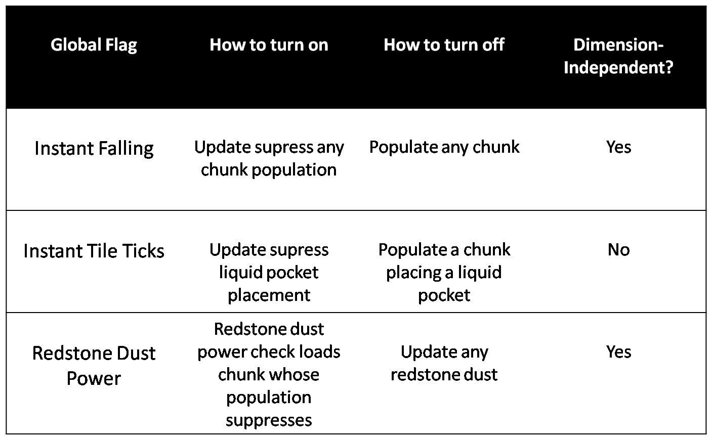

# Global Flags

This page is about global boolean flags that can be turned on or off.

A video showcase of Instant Tile Ticks and Instant Falling is in coolmann's [Instant Tile Tick Execution \[New Item Dupe\] \[Easy Bedrock Breaking\] \[Game Altering\] \[1.12\]](https://www.youtube.com/watch?v=hViDrnDCIwc)

Another video explaining global flags is [Falling Block Episode 1](https://www.youtube.com/watch?v=KU3lN1IUhuE).

## Table of Contents

- [Instant Tile Ticks](#instant-tile-ticks)
  * [Observers](#observers)
  * [Dispensers](#dispensers)
  * [Gravity affected blocks](#gravity-affected-blocks)
- [Instant Falling](#instant-falling)
- [Redstone Power Flag](#redstone-power-flag)

# Instant Tile Ticks
Instant Tile Ticks can be turned on by [update suppressing the population of a liquid pocket](chunk/population.md#instant-tile-ticks).
Instant Tile Ticks are sometimes abbreviated as ITT.

When ITT is on all tile tick blocks perform their actions [immediately](tick-phases.md#immediate-updates) when they get updated, instead of scheduling their action for the [tile tick phase](tickphases.md#tile-ticks).

ITT is dimension-dependent: Changing it in the overworld will not change it in the nether, and changing it in the nether will not change it in the overworld.

It is impossible to turn on ITT in the end (without some kind of serious hardware failure), because no liquid pockets get generated in the end.

While ITT is on, tile tick blocks will only work if they are more than 8 blocks away from unloaded chunks. Within 8 blocks of unloaded chunks they ignore all updates and just do nothing.

There are many ways for the game to crash while ITT is on. The following things cause crashes:

- Non-player entities stepping on non-floating pressure plates
- Non-player entities stepping on string
- Minecarts driving on detector rails
- Frosted ice being created with light level 11 or lower

Wooden pressure plates are naturally generated in villages.
Before turning on ITT it is recommended to remove all wooden pressure plates from all villages in loaded chunks, to prevent villagers from randomly crashing the server.

Some interesting behaviors of blocks on ITT include the following.

## Observers
If an observer is updated it turns on and off and then sends out block updates.

If a chain of n observers is updated, then the last observer of the chain sends out 2^n block updates.
The stacksize required for this is proportional to n.
This makes it possible to create exponential lag without running into a stack overflow.
The block updates at the end of the observer chain are send out at a very high frequency.
This makes observer chains very useful async lines.

## Dispensers
When an unpowered dispenser receives power and is updated it will do the following things:
1. Use one of the items in the dispenser.
2. Decrement the used item stack / Damage flint and steel / Replace liquid bucket by empty bucket
3. Replace the dispenser block by a powered dispenser block.

The fact that the dispenser uses the item before it replaces itself by a powered block and before it decrements the item stack can cause dispensers to be stuck in update suppressing loops.

A dispenser containing only a liquid bucket will place the liquid in front of itself. The placement of the liquid sends block updates. One of the block updates goes to the dispenser.
Since the dispenser is still an unpowered dispenser block and since the bucket it contains still contains the liquid, the disepsner will place the liquid again in a loop, and cause an update suppression.

A similar loop and update suppression occurs if the dispenser has a flint and steel and a fire block cannot survive on the block directly in front of the dispenser.
The dispenser will create a fire block in front of itself. Since the fire block cannot survive, it will instantly delete itself, update the dispenser and create a loop.
In this loop the durability of the flint and steel never gets decreased.

## Gravity affected blocks
If ITT is on and instant falling is off, updating a floating gravity-affected block n times in an [entity-processing chunk](chunk/chunk.md#entity-processing) will create n falling block entities.
Usually the first of those falling block entities will delete the gravity-affected block and all other falling block entities will delete themselves.
For more information see [gravity affected blocks](falling-block/gravity-affected-block.md).

# Instant Falling
Instant Falling is turned on whenever a [population is update suppressed](chunk/population.md#instant-falling).

If a floating [gravity affected block](falling-block/gravity-affected-block.md) processes a tile tick while instant falling is on, or if it is updated while instant falling and ITT is on, then it will do the [instantfalling behavior](falling-block/gravity-affected-block.md#instantfalling-behavior).

Instant Falling is dimension-independent: Turning it on in one dimension turns it on in all dimensions.
In singleplayer Instant Falling is world-independent: If you turn on Instant Falling in one world, then leave the world and open another world, then Instant Falling will still be on as long as you didn't populate any chunks when opening the new world.

Instantfalling dragon eggs can break bedrock except at y=0. Turning on the instant falling flag and using dragon eggs is one of the easiest and fastest ways to break bedrock above y=0.

# Redstone Power Flag
The redstone power flag is turned off if an update suppression occurs while a redstone dust block is checking whether it is receiving power.
Update suppressing this consistently requires the [getBlockState() to setBlockState() property of terrain population](chunk/population.md#redstone-power-suppression).

When the redstone power flag is off, blocks no longer receive any power from redstone dust blocks.

The redstone power flag is dimension-independent: Turning it off in one dimension turns it off in all dimension.
But in singleplayer it is world-dependent: Leaving a world and opening a world will reset the redstone power flag, so that it is on again.
