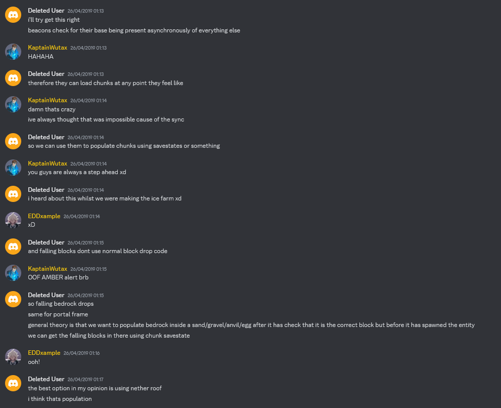
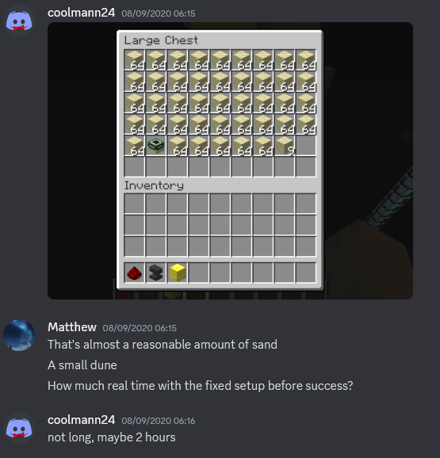
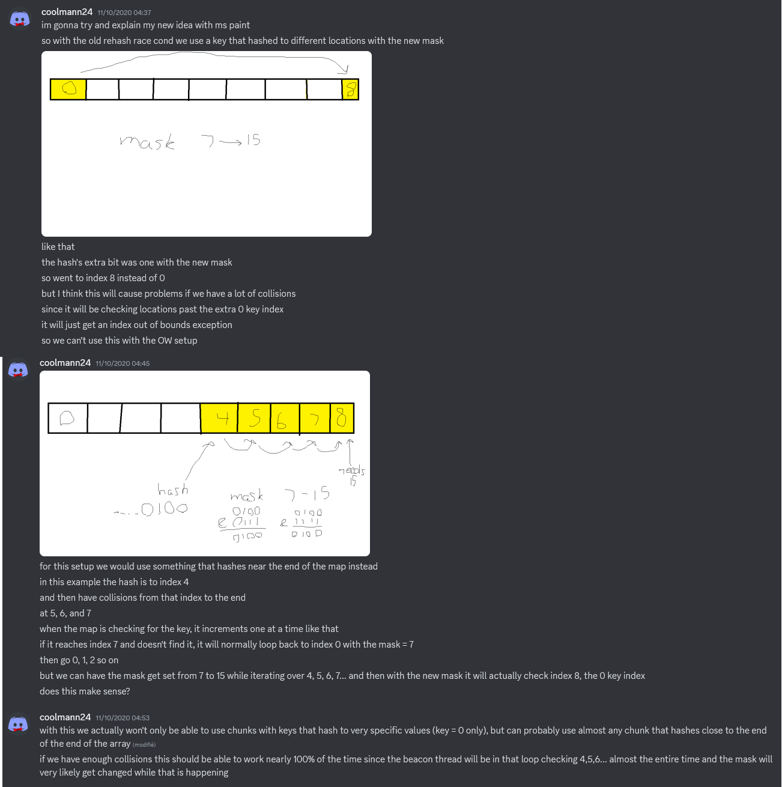
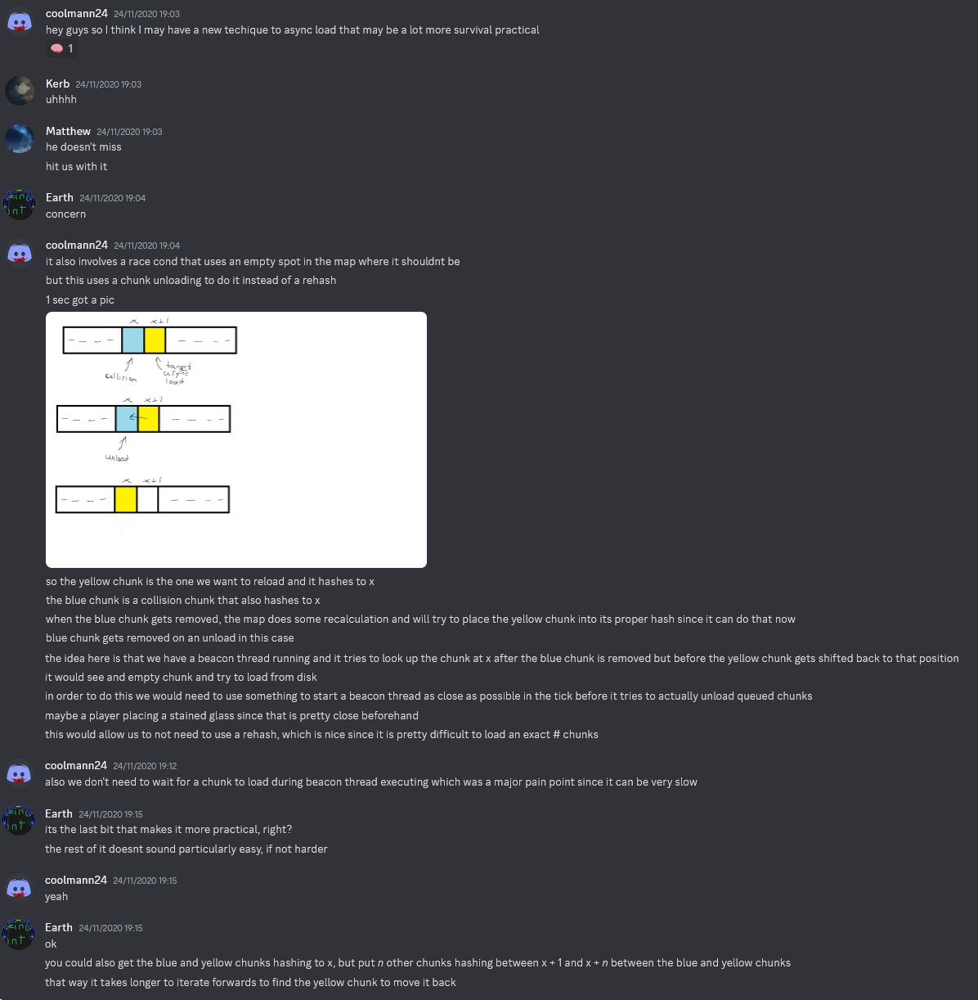

This contains various bits of technical minecraft history.

## Table of Contents

- [Slimeblocks, tnt duping and pig spawner generation](#pig-spawner-history)
- [Falling Block History](#falling-block-history)
  * [Early History](#early-history)
  * [Backdoor Tearm](#backdoor-tearm)
  * [Threadstone Discord](#threadstone-discord)

# Slimeblocks, tnt duping and pig spawner generation <a name = "pig-spawner-history">

When mojang initially added slimeblocks, they were bouncy, but they did not stick to other slimeblocks and did not allow for easy flying machines.
CodeCrafted made a troll video [Minecraft: "Sticky" slime block | Pull multiple blocks](https://www.youtube.com/watch?v=IPm4m1zBd9Q) pretending that slimeblocks had a connectivity property, allowing sticky pistons to pull multiple slimeblocks at once. This was made in a snapshot during which slimeblocks did not have that property.
After that video a large part of the community wanted it to be real.

Panda4994 and KaboPC coded a mod that implemented the slimeblock connectivity properties we know today. They submitted it to mojang,
and mojang included it in the 1.8 snapshots. Panda4994 showcased the new slimeblock properties in [Sticky Slime Blocks](https://www.youtube.com/watch?v=EIK2l4KGB_8).

Since the 1.8 piston code was coded by Panda4994 and not Mojang, 1.8 is the first version since the introduction of pistons to not include a piston based TNT duplication bug.
TNT duplication exists in all version from [1.7.3 beta](https://www.youtube.com/watch?v=CmoM_Um8Ltw) to [1.7.10](https://www.youtube.com/watch?v=mIdaap8O8Vg), but not in 1.8.

At the same time, Panda4994's piston code makes it easy to [generate pig spawner in 1.8](https://www.youtube.com/watch?v=A5inDOkNUQo).

TNT duplication and [pig spawner generation](chunk/population.md#moving-immovable-blocks) are in some sense opposite bugs.

TNT duplication means that if a piston wants to push a block (like TNT), but the block then gets replaced by a different block (like air, because the TNT got ignited) the piston will still push the old block (the TNT).

Pig spawner generation means that if a piston wants to push a block (like stone), but the block then gets replaced by a different block (like a spawner, because of a terrain population) the piston will push the new block (the spawner).

Naively fixing one bug makes the other bug easier to perform.

The coding style of mojang makes tnt duplication easy and pig spawner generation difficult.

The coding style of Panda4994 makes tnt duplication difficult and pig spawner generation easy.

In 1.9 mojang changed the code of the BlockPistonBase class and re-implemented TNT duplication.
But they left the BlockPistonStructureHelper class by Panda4994 and KaboPC unchanged. For this reason it is still possible to pull spawners in 1.9-1.12., but the update order is much more precise and requires the [getBlockState() to setBlockState() property of terrain population](chunk/population.md#get-to-set).

In early 2017, before the technique for pulling spawners was discovered, Panda4994 and RedstoneSpire were trying to find a way to generate pig spawners.
Their idea was to cause an update suppression right after the spawner placement.
But before they finished and published their contraption, Myren Eario found and published the pulling spawners technique, and became the first to generate pig spawners.
Myren only found the technique because of the slimeblock code that Panda4994 made for 1.8.
If Panda4994 had included TNT duping in the 1.8 code, then he would have been the first one to generate pig spawners. Since he did not include TNT duping in his code, he was not the first.
After Myren's publication, Panda4994 and RedstoneSpire decided to not publish their update suppression contraption at all. The reasons for this were connected with instant tile ticks.

# Instant Tile Ticks

As mentioned previously, Panda4994 and RedstoneSpire were trying to create pig spawners by causing an update suppression during dungeon population.

Since any update suppression during terrain population necessarily turns on the instant falling flag, Panda4994 and RedstoneSpire inevitably discovered the instant falling flag during their research.

They then also found the instant tile tick flag. They have one unlisted video about it: [Weird weird behaviour :D](https://www.youtube.com/watch?v=rjoaEOhIV6E).
The rest of the community only learned about instant tile ticks in 2019 when [cool mann discovered and published it](https://www.youtube.com/watch?v=hViDrnDCIwc).

Panda4994 and RedstoneSpire not only discovered instant tile ticks, but also realized that there was a way of turning it on that was independent of the stacksize of the server.
This means you do not need 10000 rails to turn it on, but only need a small tile tick clock to cause the update suppression.
This insight was only re-discovered by punchster2 in late 2021 during falling block research, and was published in [Falling Block Episode 1](https://www.youtube.com/watch?v=KU3lN1IUhuE).
Before that multiple servers build instant tile tick switches in survival using 10000 rails. for example [this server](https://www.youtube.com/watch?v=6VKNOyuqFnQ&t=510s) and [this server](https://www.youtube.com/watch?v=T7YRu9Yohec).

Since a stack-independent method for turning on instant tile ticks allows you to crash a server without too much effort, Panda4994 decided that the topic required responsible disclosure.
He probably intended to inform mojang about it, and get instant tile ticks fixed in some 1.11 version before publishing his contraption. After Myren published his pig spawner generation method that did not involve any global flags, Panda4994 decided to not disclose his findings at all, but just keep them secret.

So if Myren had not published his pig spawner generation technique in early 2017, then the community would have found out about instant tile ticks in 2017 instead of 2019,
they would have found out about stack-independent methods for turning it on in 2017 instead of 2022, and instant tile ticks would probably have been fixed in 2017 in some 1.11 version. 

# Falling Block History
## Early History
The earliest appearance of the idea is in a private scicraft discord chat in 2017.
It is only worth reading cool mann's comments in this conversation, because the others do not yet understand his highly speculative idea.

Coolmann mentions not only the idea of falling block swaps, but in the last comment also mentions the instant tile tick flag.

Then nothing happens for 1 and a half years.

Then Earthcomputer discovers the [stained glass thread code](threads.md#stained-glass-threads),
and talks about it on the public Monkeys discord. The "Deleted User" in the following conversation in Earthcomputer. The conversation is in the `bedrock-item-yes` channel on the Monkeys discord.

Note that the beacon does not actually check its beacon base asynchronously, and that nether roof bedrock is not placed by population.
But the basic idea of using the stained glass thread to perform a falling block swap to get a bedrock item is already there.

The question is now just how to load a chunk using the stained glass thread.

Xcom started working on the project, but then decided to first investigate other methods for getting the bedrock item.

A few months later, Xcom and Matthew Bolan got the bedrock item in 1.8 from [end crystal tower population](chunk/population.md#18-bedrock-item-from-end-crystal-towers).

A few months after that, Earthcomputer, Xcom and other people got the bedrock item in 1.12 by silk touch mining it during [end gateway population](chunk/population.md#112-bedrock-item-from-gateways).

With this the bedrock item was obtained.

However the falling block method also promised other unobtainable items like end portal frame and spawners, so research returned to the falling block method.

## Backdoor Tearm
The event that properly started falling block research was the publication of [cool mann's homework](https://docs.google.com/document/d/1rTKfmVLAtmvBMWW1QSgnetSG8Fuit5CaUvV77T9SgXk/edit).

The document was written on 27th August 2020, and published in the description of cool mann's video [It works](https://www.youtube.com/watch?v=TiQMMwMJIzM) on 28th August 2020.

On the same day Xcom published the video [The final quest [1.12 or lower]](https://www.youtube.com/watch?v=ubVJ_JZFqec), announcing that he will work on falling block research in his twitch streams.
From these twitch streams there is nothing publically available any more except for a few [clips](https://twitchtracker.com/xcom6000/clips).

On 31th August also a private discord chat called "Backdoor Team" was created, containing initially
Xcom, cool mann, Earthcomputer, Matthew Bolan and Kerb.

On 7th August, cool mann released his video [How to Get All* Unobtainable Blocks as Items in Minecraft Survival [1.12] pt. 1](https://www.youtube.com/watch?v=VTbpUjK-A74).

One day later, cool mann manages to get an end portal frame item from his non-surviva-friendly setup without mods to critical parts of the code.

But cool mann's setup only worked in the end dimension, because it used void chunks.

The next task was now to make a rehash chunk swap setup that works in the overworld.
This was considerably more difficult, because overworld chunks have much more chunk sections, [which is bad for rehash chunk swaps](chunk/async-chunk-loading.md#upsize-rehash-chunk-swap).

Rehash chunk swaps without cluster chunks only work in locations with very specific seeds. An explanation of this fact is [here](chunk/chunk-hashmap.md#get-rehash).
Also the intention was to directly do a falling block swap during the chunk swap,
so the end portal frame blocks had to be in the chunk with the specific seed.

So it initially seemed like the method could only be used to obtain end portal frame items in worlds in which a stronghold happens to generate in a chunk with the exactly correct hash value for rehash chunk swaps.
In most worlds such a stronghold does not generate.

To overcome this problem, cool mann proposed using cluster chunks to increase the number of positions where rehash chunk swaps could be performed.

(For accurate crediting I should remark that cool mann was not the only one in the group thinking about combining cluster chunks with the rehash chunk swap.)

With this one could perform rehash chunk swaps in any world whose hash value is close to the end of the array. This requirement was sufficiently generous to get end portal frames in most worlds.
Using this idea, cool mann created an end portal frame item setup for the Hekate server. A world download for this setup is [here](https://www.mediafire.com/file/2l7gfzedckdd398/hekate_setup_42.rar/file).

However this setup was never build in survival.

Instead cool mann proposed that one should use unload chunk swaps instead of rehash chunk swaps:

Then cool mann also proposed that one should not just do the falling block swap during the chunk swap,
but try to keep the async thread alive in an ITT clock.
He showed [an unlisted video](https://www.youtube.com/watch?v=ev3AjEl_vUQ) in which an async thread was kept alive for several seconds using redstone dust lag.

And then cool mann got burned out and stopped working on the project forever.

Cheater Codes suggested using long [ITT observers lines](update-multiplier.md) instead of ITT clocks, and thus the idea of [async lines](async-line.md) was born.

To create an async line you do not just need async chunk loading, but the async chunk loading needs to trigger a terrain population.
Since [invisible chunks](chunk/population.md#invisible-chunks-1) had not been discovered yet, there was no known way to put beacons into unpopulated chunk,
and no way to get a terrain population from async chunk loading, unless the asyncly loaded chunk was unpopulated on disk.

Also there was also no clear evidence that beacons were really that important. 
So beacons were unwisely removed, and Kerb and Cheater Codes spend many months testing rehash chunk swap setups in the overworld with a few hundred cluster chunks and zero beacons.

## Threadstone Discord

