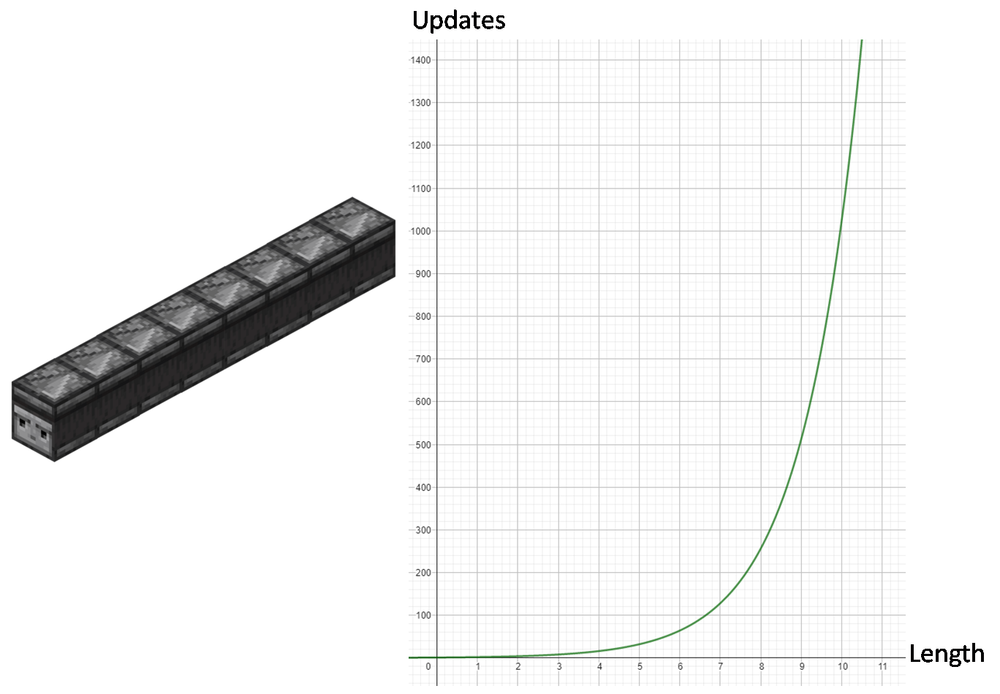
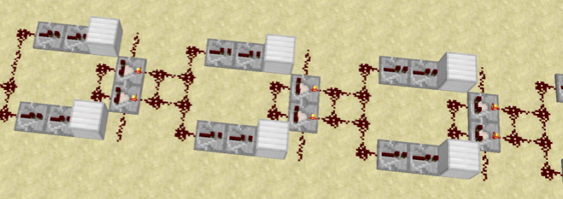
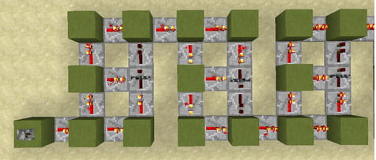

# Update Multipliers / ITT Observer Chains ☆

- [Introduction](#introduction)
- [Applications](#applications)
  * [Async Lines](#async-lines)
  * [Lag Spikes](#lag-spikes)
  * [Spamming Block Updates](#spamming-block-updates)
- [Non-observer update multipliers](#non-observer-update-multipliers)

# Introduction

An *update multiplier* is a redstone contraption that detects updates or redstone power changes at its input,
and [immediately](tick-phases.md#immediate-updates) sends out multiple updates or redstone power changes at its output, in such a way that the output could be used to activate a copy of that same update multiplier multiple times.

Update multipliers usually require [instant tile ticks](global-flags.md#instant-tile-ticks) to work.

If ITT is on, then an observer block is an update multiplier, and it is by far the most important kind of update multiplier.

An *update multiplier chain* is a chain of identical update multipliers, where the output of each update multplier is connected to the input of the next update multiplier in the chain.

The number of update multipliers in the chain is called the *length* of the chain.

The number of block updates that get send out at the end of an update multiplier chain increases exponentially with the length of the chain.

This makes long update multiplier chains very laggy, and and activating them causes lag spikes that can last hours, weeks or centuries, during which millions of block updates get send out.

For example a chain of ITT observers of length n, sends out 2^n block updates at the end of the chain, and a chain of 40 observers usually requires several weeks to finish.

# Applications

## Async Lines
When a long update multiplier chain is activated on an async thread it becomes an [async line](async-line.md).

## Lag Spikes
Sometimes one can positively influence race conditions by creating lag spikes on the main thread.
Update multiplier chains are a good way to create such lag spikes.

Examples for this are all over the place in threadstone. Here is a highly incomplete list of such examples:
- Once can [prevent crashes during async chunk loading](chunk/async-chunk-loading.md#preventing-crashes-during-async-chunk-load) by causing a lag spike on the main thread in the block event phase, while the async thread loads in the entities and tile entities of the asyncly loaded chunk.
- In the [falling nether portal contraption with async portal lighting](falling-block/falling-block-swaps.md#nether-portal-1) a short observer chain, that is called line 1 in the article, is activated on the main thread solely to give the async thread time to check the obsidian frame and start lighting the nether portal. Then an observer chain, called line 2 in the article, is activated on the async thread, solely to create a lag spike on the async thread to give the main thread time to push a sand block into the obsidian frame.

Furthermore lag spikes on the main thread can be used to give the player time to input a series of player actions, which will after the lag spike all be executed in a single gametick.
This trick is used in:
- In the [classical unload chunk swap setup](chunk/async-chunk-loading.md#classical-multiplayer-unload-chunk-swap), players need to both schedule a chunk unloading and place multiple stained glass blocks within a single player phase.
- Player head creation
- The [gateway method for 1.12 bedrock item](https://www.youtube.com/watch?v=ajUea-FnRrc). Although traditionally one uses tnt instead of an update multiplier to create the lag spike in this case.

## Spamming Block Updates
Update multipliers can be used to rapidly spam block updates.

Examples of where this is used include:
- In every [falling block swap contraption in which the `setBlockState` happens on the async thread](falling-block/falling-block-swaps.md#set-on-async),
there will be an update multiplier activated on the main thread which rapidly spams block updates into a gravity-affected block to create falling block entities at a high frequency and make a falling block swap possible.
- In [gravity block based word tearing contraptions](word-tearing.md#gravity-block-mixers) one uses update multipliers to spam several hundred block udpates into a gravity affected block, to create several hundred falling block entities, each of which does a word tearing attempt.

# Non-observer update multipliers
In the vast majority of circumstances observer chains are the best update multipliers.
But there are also other update multipliers.

When ITT is on, any chain of tile-tick based XOR gates, in which block updates from later XOR gates cannot travel back to earlier XOR gates, is an update multiplier.

There is also a directional update multiplier that uses only repeaters:

One can also keep an async thread alive for roughly one minute in a [tile-tick-less rail-based update multiplier](https://www.youtube.com/watch?v=uVfT5w8RSyQ&list=PL8r-bvM9ltXNkjl7IhGQAHygIPfy2niuC&index=50), 
provided another thread is toggling the [redstone power flag](global-flags.md#redstone-power-flag) very quickly. This kind of async line could in principle work without ITT, but in practice it is difficult to get it to work.

Possible reasons for using non-observer update multipliers are as follows:

- In 1.8 and in skyblock one might not have access to observers, but one might have access to repeaters, and can build the repeater based update multipliers.
- In 1.13 instant tile ticks do not exist, and one needs to use a rail-based async line to keep async threads alive.
- If a good async line without observers, repeaters and comparators were found, it would make it possible to run async lines in the nether and have [fire blocks loaded without crashing the game](async-line.md#ticknexttick-list-ouf-of-synch-crash).
